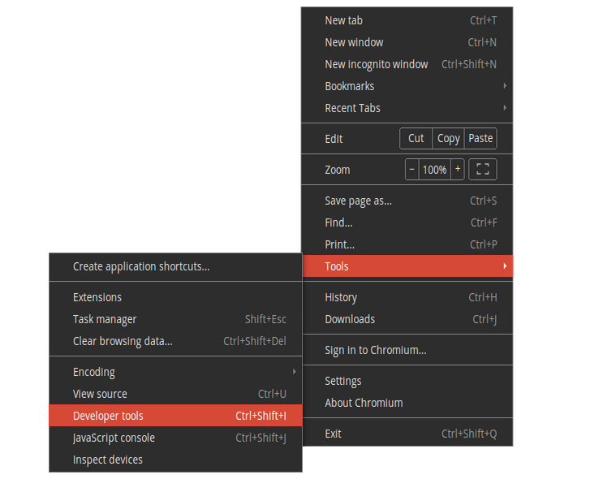

## Troubleshooting Checkout issues

The checkout steps in J2Store use AJAX extensively in order to provide customers with a better online shopping experience. Customers do not have to wait for the checkout pages to refresh. The entire checkout is handled within a SINGLE PAGE and the checkout steps are loaded in an accordin style.

If your checkout steps are not working, then follow the checklist here to troubleshoot

#### Caching and JS optimize

Please check if you have enabled conservation caching in Joomla Global configuration. If yes, disabled caching in global configuration and then check if checkout works.

Also make sure you have not enabled **System - Page Cache** plugin and **System - J2Page Cache** plugin.

If you are using any JS optimize plugin, that will also cause this issue.

#### Javascript conflicts

Since checkout steps are loaded in real-time using Ajax, any Javascript conflict in your site might affect the process. You will see the Checkout steps not unfolding or when you press continue button, nothing will happen.

**Solution:** Installing and configuring a Javascript manager like jQuery Easy plugin will solve most of the issues. If the problem remains unsolved, follow the troubleshooting method described below.

**Troubleshooting Method:** Open your website in the Google Chrome browser. Open the browser menu and go to Tools -> Developer Tools

You can see the Developer Tools window opening at the bottom of the browser. Navigate to the Console tab.

Now Refresh your website, add a product to cart and go to checkout. The Console tab will now show you javascript conflicts, if any, in the site. It will also show you the file name and the line number that produce the error. Take a screenshot and send it to us and also send a copy to your template provider. We will check and get back to you with the solution.

#### Issue with Account Registration and FreeBSD

Sometimes, customer will not be able to pass the Account Registration and Billing step. To solve this issue, please make sure that the Allow Registration is set to YES in Joomla Administration - Users - Options

If the problem continues, go to Joomla admin - system - System Information tab.

IMPORTANT NOTE: The following instruction applies only to those running PHP on a FreeBSD operating system.

Check the value for PHP Built On. It tells you the Operating system of your hosting server.  If it says, FreeBSD, then contact your host. In FreeBSD, the Filter extension is not enabled by default. Enabling it solves the problem. More information can be found [in this thread](https://forums.freebsd.org/threads/30465/)

#### Checkout goes in Loop

Sometimes, customers will be redirected from the Shipping and Payment step to the first step (Loop). Or you may not be able to proceed when you click Continue at the Billing or the Shipping step.

Solution: Go to Users -> Options

Make sure the following fields are set as per the configuration given below. And then do a purchase and see if the checkout works fine.

If you still face issues, then there could be several reasons for this behavior. Please create a private ticket (Go to the support menu ) and provide super user logins. One of our developer will help you troubleshoot and solve the problem.

#### Could not proceed to payment step. Stuck at the Shipping step

Make sure you are not having any old template overrides. If you are using a template like JSN One, you might be having template overrides for checkout layout.

Go to /templates/YOUR_TEMPLATE/html/com_j2store

Do you see a folder named: checkout

If yes, rename it as: old_checkout

Now check.