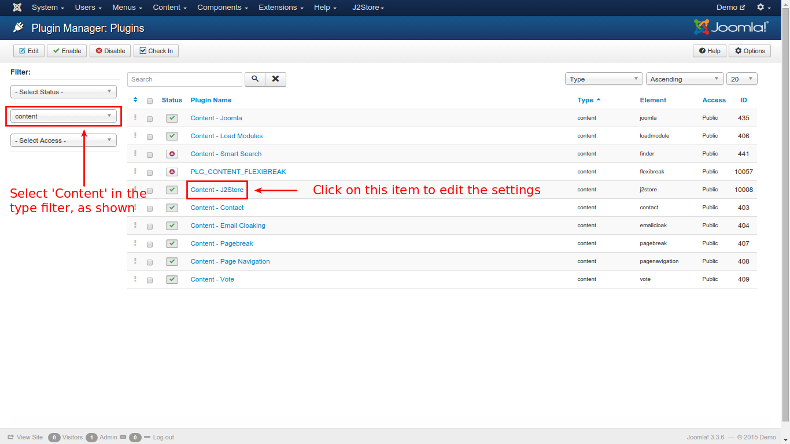

# Troubleshooting Image Duplication

Products are supported with images for customers to understand the product better. In some cases duplication of images occur and this should be avoided. This section briefs about such a case.

### Adding images in article creation

When an article is created, usually the images are added in the **Images** section of product configuration in the J2Store tab. Images can also be added in the **Images and links** tab of article creation. Its absolutely acceptable to add images in both locations. Its illustrated in the below images.

If it is saved and viewed in the store, it would look like the image below:

This is because, the content plugin settings are set to **Yes** for *Display images* option. This is given below for better understanding:

With this settings, duplication will occur. To eliminate the duplication, follow the procedure:

* From the joomla main menu, go to **Extensions -> Plugin Manager**

* From the resulting window, select **Content** from the *Select Type* filter on the left pane and click on **Content - J2Store** from the list, as illustrated in the image below

* From the resulting window, select the **Category View** tab to set the values, as shown in the image below:

 

* After setting the **Display image** option to **No**, go to **Item View** tab to set the value as shown below:

* Now, click **Save & Close**.

* The store will now display the products as shown the image, eliminating the duplicate image:

