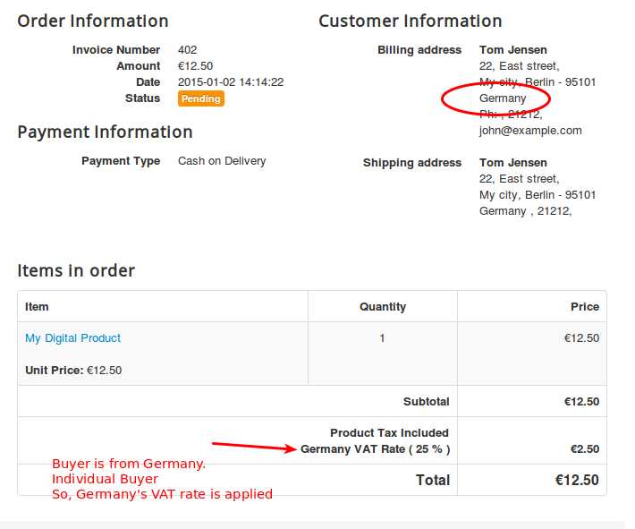
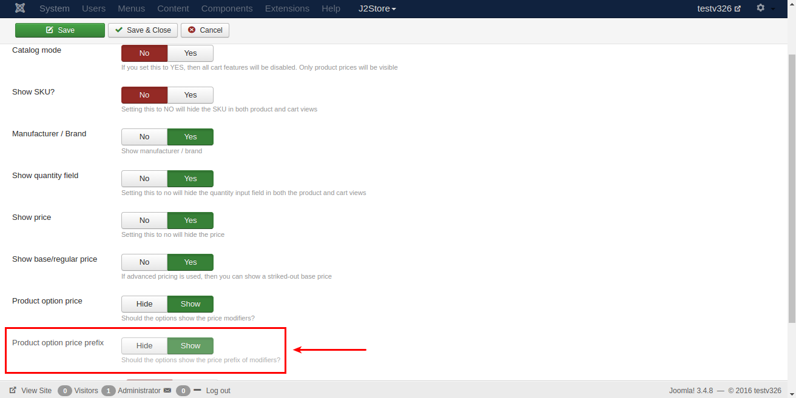

#Troubleshooting Common Issues

* **[Change default country in checkout](#change_default_country)**
* **[Order products in list layout](#order_products)**
* **[Troubleshooting update related issues](#update_related_issues)**
* **[Migrate from version 2.x to version 3.x](#migrate)**
* **[Options from dropdown cannot be selected](#options)**
* **[Troubleshooting USPS, FedEx, UPS and CanadaPost shipping plugins](#troubleshoot_shipping)**
* **[A simplified guide for New EU VAT rules 2015 and setting them up in J2Store](#eu_vat_rules)**
* **[solve jQuery conflict with Multi-categories component](#multicateogries)**
* **[Writing template override for the frontend order view and print layouts](#template override)**
* **[Troubleshooting Checkout issues](#checkout_issues)**
* **[How To Solve Mini Cart module related issues](#mini_Cart_issues)**
* **[HOWTO make checkout address field labels language friendly](#checkout_field_language)**
* **[Troubleshooting Paypal-related issues](#paypal_related_issues)**
* **[Selling Digital Goods Online with J2Store](#digital_folder)**
* **[HOW TO override the layout of Add to cart block](#override_addtocart)**
* **[How to create a new currency in J2Store?](#currency)**
* **[Common mistakes to avoid when setting up Standard Shipping methods in J2Store](#shipping)**
* **[Joom SEF configuration for J2Store](#joomsef)**
* **[How to Remove + and - Prefix in Product Option Price](#remove_prefix)**
* **[I don't see Add to Cart Button. What is the problem?](#no_add_to_cart)**
* **[Paypal duplicate invoice ID and how to solve it](#duplicate_invoice)**
* **[HOW TO move Add to Cart Button using the Short Plugin tag](#move_cart_button)**
* **[HOW TO upgrade from FREE version to PRO?](#free_to_pro)**
* **[HOW TO Disable Shipping Address step and Payment Methods in Checkout](#disable_shipping_payment)**
* **[HOW To Translate the Address Field Labels](#translate_addr_fields)**
* **[HOW TO change the colour of add to cart buttons](#color_cart_button)**
* **[Writing a Layout override for Joomla article manager - An intro image](#override_intro_image)**
* **[HOWTO solve javascript conflict between some of RocketTheme templates and J2Store](#rocket_js_conflict)**
* **[HOWTO create a custom thank you message](#thank_u_message)**
* **[HOWTO translate j2store / fix language and translation related issues](#language_override)**
* **[Installation of J2Store](#j2store_requirements)**

<a name="change_default_country"></a>
##[HOWTO] Change default country in checkout

1. Login to Joomla administrator and go to Components -> J2Store

2. Go to Set up - > Custom fields

3. Open the Country field and choose your default country. Save.

4. Open the Zone ID field and choose your default zone. Save.

5. Clear Joomla cache and check.

<a name="order_products"></a>
##[HOWTO] Order products in list layout
The product list layout by default takes the ordering in the Article Manager. However, you can change this ordering (on page load / refresh) via the Menu Parameters.

NOTE: This tutorial applies only for those using the J2Store's Product List Layout in Version 3. If you use the default article layouts, refer the Joomla documentation on ordering of articles.

Login to Joomla administration and open the menu that links your product list.

Under the Common Options tab, you can find Article Order parameter. There you can choose the ordering method.


<a name="update_related_issues"></a>
##Troubleshooting update related issues

J2Store uses the Joomla Extension Manager for providing updates to both the free and pro users. On a few occasions, you may not be able to access the updates via the Extensions Manager. You may get a 403 access denied when you try to update in your site. It might be due to several reasons. We have listed a few that might cause this problem.

* **Download ID:**

   We provide a Download ID when you subscribe. You can find this Download ID in two places.
1.In the PDF invoice we have issued to you
2.In our website's My Downloads section. Direct link: http://j2store.org/my-downloads.html

  You should copy the Download ID and paste it in J2Store - Set up - Configuration - Update tab.

  NOTE: If you have re-set your password in our site, then a new download ID will be issued (due to security reasons and prevent unauthorized access.) 
Please make sure that the Download ID is correct.

* **Time out:**

  J2Store uses the Joomla Extension Update tool. A time out will occur if your connection is slow or if our server responds slower (which sometime occur if there are huge number of download requests)

  In this case, just try again after a few minutes. You will usually get through.
  
* **Firewall:**

  If you make repeated attempts or requests, then our firewall might block the access for a temporary period (usually 10 minutes).

  In this case, please try after 10 minutes.

  If still you get the error, you can always download the latest version from our My Downloads section: http://j2store.org/my-downloads.html and install it via the Extensions manager.
  
<a name="#migrate"></a>
##[HOWTO] Migrate from version 2.x to version 3.x

With the release of Version 3, J2Store has emerged into a much more powerful e-commerce application for Joomla. Version 3 of J2Store is completely re-written from scratch using FOF Framework and follows a completely different table structure. It comes with quite a lot of new features and supports different product types.

As a result, you cannot install Version 3 directly over the version 2. It involves a migration. And don't worry!. We have simplified the migration process by developing a nice tool. We have also created a step-by-step guide that will walk you through the entire migration process.

[Click here to Download the migration tool and read the guide](http://j2store.org/support/user-guide/migrating-from-2-x-to-3-x.html)

<a name="options"></a>
##[HOWTO] Options from dropdown cannot be selected

This issue occurs when your site has two instances of the Jquery UI library.


**In Version 3:**

Go to Configuration - basic settings
Set the Load Jquery UI to Only Front End.
Save

**In Version 2 :**
Go to J2Store - Options - Basic settings
Set the Load Jquery UI to Only Front End.
Save.

Clear Joomla cache and refresh. Now try

<a name="troubleshoot_shipping"></a>
##Troubleshooting USPS, FedEx, UPS and CanadaPost shipping plugins

You have installed the shipping plugin but it doesn't show up during the checkout. Here are a list of reasons that might be preventing the plugin from fetching shipping cost real-time from the APIs of the Shipping carrier.

* **Enable Shipping**

  Well. This might sound trivial. But some of us often forget to turn on the Enable shipping switch while creating the product. Make sure that Enable shipping is set to YES.
  
* **Weight and Dimensions**

  All the shipping carriers use the weight and the dimension of your product (Length, Width & Height)to calculate the shipping cost (besides using the destination address). So make sure that you enter the Weight and the dimension of your product.

 You should select the weight and the length measurement unit from the drop down list.
 
 

 **IMPORTANT for those using UPS:** Only KG (Kilogram) and LB (Pound) are supported by UPS as the weight measurement units.  Similarly, only IN (Inch) and CM (Centimetres) are supported as length measurement units. There is more. If you use Pound (LB) as the weight measurement, then the length measurement should be Inch (IN). Similar if KG is used, then CM should be the measurement.

 Also make sure that you choose the correct measurement units in the plugin settings as well. If the measurement units used in the products does not match with the settings in the plugin, then J2Store will attempt to convert the values to the measurement unit set in the plugin.

* **API credentials**

  All shipping carriers have a web service and provide credentials to access their Rate API. Some of the carriers like USPS offer TEST accounts as well. Make sure you enter these credentials correctly in the Plugin. Some of the carriers provide Customer number (like Canada Post ) and a few other parameters as well. Refer the documentation PDF that come with each plugin for more information.
  
* **Geozone**

  All the plugin come with a geozone filter setting.

  If you choose a geozone, then this shipping plugin will apply to only to customers coming from the countries/zones added under it.

  During testing, make sure that this param is set All geozones.
  
* **Debug Mode**

  In your plugin settings, set the Debug mode to YES. This will allow the plugin to log the responses sent by the APIs of the shipping carriers.

  The log is stored in the /cache folder of your Joomla Root. You can use your Hosting CPanel's file manager or an FTP program like FileZilla to access the log file. The log should give you a lot of information.
  
  

 ***VERY IMPORTANT: Debug mode SHOULD NOT be enabled in LIVE / PRODUCTION sites.***
 
Still not working, please create a private ticket or email us the log file. We will help you troubleshoot the plugin.

<a name="#eu_vat_rules"></a>
##A simplified guide for New EU VAT rules 2015 and setting them up in J2Store
If you are a seller of digital goods and services, you would probably wondering about the new European VAT rules that came into effect from January 1, 2015.

Since the rules are a bit of pain, we have come up with a simplified guide which will help you implement the new rules easily in your J2Store joomla shopping cart.

####The New VAT rules
In simple terms, the new VAT rules are:

– if the company sells to any countries in the EU, they will have to charge VAT in the country of the buyer instead of the seller.

– if the buyer of the digital goods is an individual, the company has to charge the VAT percentage from the country of the buyer

– if the buyer of the digital goods is a company (with a valid VAT number), there is a 0 percent VAT charge.

– if the buyer of the digital goods is a company without a VAT number or has an incorrect VAT number, then VAT of the country of the buyer must be charged.

– if the company sells digital goods to companies or individuals in their own country, local VAT needs to be charged.

####Implementing VAT rules in J2Store
**EU VAT plugin**
We have created a VAT plugin that helps you implement the VAT rules automatically.
Download and install the plugin from here:
http://j2store.org/extensions/general-plugins.html

**Implementing VAT rules in J2Store**

Let us assume that your company is located in : United Kingdom, Bristol And your home country (local ) VAT is 21 %

* ***Store Profile***
  Go to Joomla admin – J2Store – Set up – Configuration - > Store tab.

  Set the Default Country to United Kingdom Set your Default Zone to Bristol

* ***Geozone***
  Go to Joomla admin – J2Store – Localisation – Geozones – New

  Geozone Name : VAT Zone ( It can be anything. It is used just as reference ) 
  State : Published

  Add country / Zone Choose United Kingdom from the Dropdown list and add it

** IMPORTANT: According to the rule, EU residents & businesses with no valid VAT number has to be charged based on the home country's rate. **

** So it is advised that you add all the EU countries in this geozone itself. Choose EU Vat countries and add them. Refer this article to know all EU VAT countries. http://en.wikipedia.org/wiki/European_Union_value_added_tax **

(You can also add all other European countries. or create a separate geozone. But then you will have to create tax rate and map that in the tax profile. Kind of a double work!).

Save and close

* ***Tax rate***

  Go to Joomla admin – J2Store – Localisation – Tax Rates – New

  Name : VAT Rate Tax Percent : 21 Geozone : VAT Zone
  Status : Published

  Setting up the tax profile
  It is sufficient to set up ONE tax profile

  Go to Joomla admin → J2Store – Localisation → Tax profiles → New

  Tax Profile Name : My Tax Profile State : Published

  Tax Rates Mapping

  Choose VAT Rate 21 % and choose Billing Address as the Associated Address.
  Save.

* ***Applying tax profile to a product***
  J2Store uses native Joomla articles as products. So go ahead and create a product.

  Go to Joomla admin – Article Manager – New or open your digital product.

  In J2Store Tab → Item Tax , Choose My Tax Profile.

  Fill in other relevant fields for your product and save.
  
####Application of VAT rules with Examples

Now we have successfully configured the tax rules in j2store. Let us see how they will get applied for different scenarios.

**Example-1: Buyer (can be INDIVIDUAL or company) from the same country (Home Country)**


Our shop is located in United Kingdom. And the buyer is from the same country. So local tax of 21 percent applies.

**Example-2: Buyer (INDIVIDUAL) from a different EU country (Germany)**


The buyer is from Germany and he is an individual customer. So we are charging him the Germany's VAT rate of 25%.

**Example-3: Buyer (COMPANY) from a different EU country WITHOUT a valid VAT Number**


The customer is from Germany. He has entered a company name. But his VAT number is INVALID. So we apply the Germany's VAT rate of 25 %.

(the EU VAT plugin validates the VAT number provided against the EU database )

**Example 4: Buyer ( COMPANY ) from a different EU country WITH a valid VAT Number**


The customer is from Germany.  His VAT number is VALID.  So NO tax is applied.

<a name="multicateogries"></a>
##[HOWTO] solve jQuery conflict with Multi-categories component

If you are using the Multi-cateogies component (which adds the ability to choose more than one category for your articles), you might experience a jQuery conflict with J2Store. Here is a quick fix

Are you using Multi-categories component ?
If yes, then the issue comes due to loading of multiple Jquery UI instances.

Here is a quick fix

Open /administrator/components/com_j2store/helpers/strapper.php

Around line 33, you will find

$document->addScript(JURI::root(true).'/media/j2store/js/j2storejqui.js');

Change this to

if($mainframe->isSite()) {$document->addScript(JURI::root(true).'/media/j2store/js/j2storejqui.js');}

Save.
Logout. Clear browser cache and test.
This should fix the issue.

<a name="template override"></a>
##Writing template override for the frontend order view and print layouts

This tutorial applies to J2store 3.x versions.

You will nedd to use your hosting CPanel file manager or an FTP client like filezilla to carry out the following tasks.

The following file control the display of order details in frontend.

orderitems.php = This controls the display the order details in email and invoice template(frontend order view)

Let us see how to override the orderitems.php

Copy /components/com_j2store/views/myprofile/tmpl/orderitems.php

to

/templates/YOUR_TEMPLATE/html/com_j2store/myprofile/orderitems.php

Edit the file /templates/YOUR_TEMPLATE/html/com_j2store/myprofile/orderitems.php

Make your changes / overrides. Save.

You need to do the same if you want to override

<a name="checkout_issues"></a>
##Troubleshooting Checkout issues

The checkout steps in J2Store use AJAX extensively in order to provide customers with a better online shopping experience. Customers do not have to wait for the checkout pages to refresh. The entire checkout is handled within a SINGLE PAGE and the checkout steps are loaded in an accordin style.

If your checkout steps are not working, then follow the checklist here to troubleshoot

####Javascript conflicts

Since checkout steps are loaded in real-time using Ajax, any Javascript conflict in your site might affect the process. You will see the Checkout steps not unfolding or when you press continue button, nothing will happen.

**Solution:** Installing and configuring a Javascript manager like jQuery Easy plugin will solve most of the issues. If the problem remains unsolved, follow the troubleshooting method described below.

**Troubleshooting Method:** Open your website in the Google Chrome browser. Open the browser menu and go to Tools -> Developer Tools

You can see the Developer Tools window opening at the bottom of the browser. Navigate to the Console tab.


Now Refresh your website, add a product to cart and go to checkout. The Console tab will now show you javascript conflicts, if any, in the site. It will also show you the file name and the line number that produce the error. Take a screenshot and send it to us and also send a copy to your template provider. We will check and get back to you with the solution.


####Issue with Account Registration and FreeBSD

Sometimes, customer will not be able to pass the Account Registration and Billing step. To solve this issue, please make sure that the Allow Registration is set to YES in Joomla Administration - Users - Options

If the problem continues, go to Joomla admin - system - System Information tab.

IMPORTANT NOTE: The following instruction applies only to those running PHP on a FreeBSD operating system.

Check the value for PHP Built On. It tells you the Operating system of your hosting server.  If it says, FreeBSD, then contact your host. In FreeBSD, the Filter extension is not enabled by default. Enabling it solves the problem. More information can be found [in this thread](https://forums.freebsd.org/threads/30465/)

####Checkout goes in Loop

Sometimes, customers will be redirected from the Shipping and Payment step to the first step (Loop). Or you may not be able to proceed when you click Continue at the Billing or the Shipping step.

Solution: Go to Users -> Options

Make sure the following fields are set as per the configuration given below. And then do a purchase and see if the checkout works fine.


If you still face issues, then there could be several reasons for this behavior. Please create a private ticket (Go to the support menu ) and provide super user logins. One of our developer will help you troubleshoot and solve the problem.

####Could not proceed to payment step. Stuck at the Shipping step

Make sure you are not having any old template overrides. If you are using a template like JSN One, you might be having template overrides for checkout layout.

Go to /templates/<YOUR_TEMPLATE>/html/com_j2store

Do you see a folder named: checkout

If yes, rename it as: old_checkout

Now check.

<a name="mini_Cart_issues"></a>
##How To Solve Mini Cart module related issues
J2Store's Mini Cart is a very handy tool for your customers when they shop. They can check the number of items in their order and the total. The cart module is refreshed in real-time using an AJax request. On a few occasions, the cart may not get updated on a real time. Here is a checklist that should help you solve the problem.

####Cache settings
Go to Joomla admin - Global configuration - System tab.

Caching is like taking a snapshot of your pages and presenting the same to every visitor coming to your site (untill the cahce is refreshed again).

Since the cart module handles dynamic data, it should be excluded from caching. In order to exclude the module from caching, your Global cache setting should be set either to Conservative Caching or Disabled. Check the screenshot below.

If you use Progressive Caching, Joomla will override the Cache settings in the module. The cart module might work fine in smarller sites with Progressive Caching enabled but if you have a larger site with a large number of visitors, then it might cause issues with the module.


####Module settings

Go to Joomla admin - Module Manager - J2Store Cart module

In the Advanced tab, set the Caching to No Cache.


####Javascript conflict

Since the J2Store updates the cart module using an AJAX request, it is important that your site does not have any javascript conflicts.

Javascript conflicts mostly occur due to loading of multiple jQuery libraries or the lack of a Javascript library. it is possible that a third party extension / module in your site might be using an older or incompatible javascript library, which might produce a conflict.

Solution A:

Please download and install a jQuery Script manager like jQuery Easy and configure it. This should solve most of the issues

Solution B:

It is not exactly a solution. Its a troubleshooting method. Open your website in the Google Chrome browser. Open the browser menu and go to Tools -> Developer Tools.

You can see the Developer Tools window opening at the bottom of the browser. Navigate to the Console tab.

Now Refresh your website. The Console tab will show you if there are any javascript conflicts in your site. It will also show you the file name and the line number that produce the error. Take a screenshot and send it to us and also send a copy to your template provider. We will check and get back to you with the solution.


####JSON support

While most of the hosting service providers enable the JSON support for PHP by default, some do not. It is easy to check if JSON is enabled or not in your hosting account.

Go to Joomla admin - System - System Information - PHP Information

You can check whether JSON support enabled or not in the PHP Information tab. if you do not find any mention of JSON, then you can assume that it is not enabled for your account. You should get in touch with hosting service provider, who can enable the JSON support for your account.

You can look for something like below in the PHP Information tab.


<a name="checkout_field_language"></a>
##HOWTO make checkout address field labels language friendly

In a multi-lingual Joomla site, the checkout step doesn't convert to other language and seems to still show in english. How to make it appear in your own language ?
Simple, just rename the custom field labels as follows and it will quickly consider picking the language strings from your local language pack.

Still if you do not see the translation, please check your language pack for the following strings and translate them in your language.

language file location /administrator/language/en-GB/en-GB.com_j2store.ini

J2STORE_ADDRESS_TYPE="Address type"
J2STORE_BILLING_ADDRESS="Billing Address"
J2STORE_SHIPPING_ADDRESS="Shipping Address"
J2STORE_ADDRESS_DETAILS="Address Details"
J2STORE_ADDRESS_FIRSTNAME="First name"
J2STORE_FIRST_NAME="First Name"
J2STORE_ADDRESS_LASTNAME="Last name"
J2STORE_LAST_NAME="Last Name"
J2STORE_ADDRESS_USER_ID="User ID"
J2STORE_ADDRESS_USERNAME="Username"
J2STORE_ADDRESS_LINE1="Address Line 1"
J2STORE_ADDRESS1="Address Line 1"
J2STORE_ADDRESS_LINE2="Address Line 2"
J2STORE_ADDRESS2="Address Line 2"
J2STORE_ADDRESS_CITY="City"
J2STORE_CITY="City"
J2STORE_ADDRESS_ZIP="Zip / Postal code"
J2STORE_ADDRESS_STATE="State"
J2STORE_ADDRESS_COUNTRY="Country"
J2STORE_ADDRESS_PHONE="Phone"
J2STORE_ADDRESS_MOBILE="Mobile"
J2STORE_ADDRESS_FAX="Fax"
J2STORE_ADDRESS_COMPANY_NAME="Company"
J2STORE_ADDRESS_TAX_NUMBER="Tax Number"
J2STORE_ADDRESS_ZONE="Zone / Region"
J2STORE_TELEPHONE="Telephone"
J2STORE_ADDRESS_EDIT="View/Edit Address"
J2STORE_SHOPPER_ADDRESSES="Shopper Addresses"

<a name="paypal_related_issues"></a>
##Troubleshooting Paypal-related issues

There could be several reasons why your Paypal Plugin is not working. This guide lists most common reasons and solutions for them.

####Order status Failed

Are you using your Primary Paypal Email as your merchant email? If your order status is failed, then chances are that you are using a secondary email of your Paypal account.

Paypal allows you to add multiple emails in an account to accept payments. With the Paypal plugin for J2Store, make sure you are using your primary Paypal account email. You can check which is your primary email by signing into your Paypal account and then going to Profile -> Add / Edit emails page.


####Currency is wrong. Paypal payment screen shows USD while my currency is different

Paypal supports multiple currencies. However, it does not support all currencies of the world. Please ensure that your currency is supported by checking this page: https://www.paypal.com/multicurrency

If your currency is not supported, Paypal will automatically assume the currency as USD.

<a name="digital_folder"></a>
##Selling Digital Goods Online with J2Store

Selling ebooks, PDF, images and files online is easy with the J2Store Joomla shopping cart. Here is a step-by-step guide to set up your digital downloads.

####Step 1: Let us create a folder on your site to upload the files

You can use your Hosting Providers CPanel File manager or an FTP client like FileZilla to access your web root (public_html / www / httpdocs )

Once you are in the web root, create a folder. Let us name it as: myfiles

####Step 2: Protect the folder from outside access

**We do not want people to access this folder using their browser and download files. So let us protect this folder using a .htaccess file.**

Create a file called htaccess.txt in your computer and open it with your favorite text editor
Add the following lines to it

order deny, allow
deny form all

Save the file. Now upload it to the folder we just have created in our web root. In our example, it is **myfiles**

**IMPORTANT:** Rename it as .htaccess

All the files uploaded to this folder is now protected.

####Step 3: Point J2Store to use the files in this folder.

Go to Joomla admin - j2store - Configuration - Basic settings.

In Folder path for digital goods, enter the name of the folder that contains your files. In our example, it is: myfiles

Save the configuration.

####Step 4: Creating your first digital product

J2Store uses Joomla articles as products. So head to Joomla admin -> Article Manager and create an article.

Fill in the title, description, add an image and set all other fields and Save.

Go to J2Store cart tab and set all the fields and Save.

Now go to files tab in the navigation you can see Set product files button.


<a name="override_addtocart"></a>
##HOW TO override the layout of Add to cart block

Sometimes you need to customise the Add to cart block and style it in a way you like. With J2Store, you can achieve this by writing a template override.

####To change the Add to cart block and style in category view

copy /components/com_j2store/templates/default/default_cart.php

to

/templates/<YOUR_TEMPLATE>/html/com_j2store/templates/default/default_cart.php

**IMPORTANT:** If you are using bootsrap 3 as a sub-template, replace the default with bootstrap3(/components/com_j2store/templates/bootstrap/..)

####To change the Add to cart block and style in item view

copy /components/com_j2store/templates/default/view_cart.php

to

/templates/<YOUR_TEMPLATE>/html/com_j2store/templates/default/view_cart.php

Make the changes and save.

<a name="currency"></a>
##How to create a new currency in J2Store?

J2Store allows you to sell in multiple currencies. You can create as many currencies as you like. You can either set the exchange value of the currency manually or allow J2Store to fetch in real-time from the Google Financial API. (In Store configuration, you should set the Auto update currency to YES)

This tutorial shows you how to create a new currency in your Joomla online store.

####Step 1: Create a new currency

Follow this guide to create new currency http://j2store.org/support/user-guide/currency.html

####Step 2: Choose your default currency

Go to Joomla admin - J2Store - Setup - configuration - store

Choose your Default Currency. Example: If you want to use EUR as the default currency, choose it.

Set the Auto update currency to YES.

Save.

####Step 3: (Optional) Publish the currency switcher module

This step is useful only for those using two or more currencies on their site.

Go to Joomla admin - Extension - Module Manager

Publish the J2Store Currency module to a position. This displays a currency switcher.

<a name="missing_currency_symbol"></a>
##Solving the missing currency symbol in your store

When you install, J2Store sets USD as the default currency. When store owners change the currency code, they often forgot to update their default currency in their store profile.

When you see the currency symbol missing, it is an indication that:

1. You have either changed the currency code or deleted the USD and then created a new currency for your country.

2. You forgot to reflect these changes in the Store profile.

Solution
Go to J2Store admin -> Set up - > -> configuration -> Store

Choose your Default Currency.

**IMPORTANT:**Hit the Save button. Even if you see your currency is selected by default, it may not be saved in the store profile database. Since it is the only currency available (you deleted the USD or any other currency), the dropdown list shows the first currency available.

So CLICK the SAVE button.

Still not seeing the Currency symbol, open your store again and click SAVE again.

<a name="shipping"></a>
##Common mistakes to avoid when setting up Standard Shipping methods in J2Store

A number of store owners use the standard shipping methods that come integrated with J2Store.

The standard methods - flat rate, weight based, quantity based and price based - are very simple to configure and use. However, owners often make a few simple mistakes, leading to the disappearance of the shipping methods during the checkout.

This post aims to help the store owners to set up the shipping methods properly.

####Enable shipping in the product parameters

While creating a product, the Enable Shipping param is by default set to NO. Most store owners do not notice this. If the product requires shipping, make sure that you set this param to Yes.

####Geozones

All the standard shipping methods in J2Store are bound by the Geozones. That is; you should always select a geozone while setting the rates. So make sure that you have created the Geozones and added countries or zones inside them.

####Set shipping rates
After creating a shipping method (by going to J2Store admin -> Set up -> Shipping -> Standard Shipping Methods), you can see a link named Set Rates. Click on it to set the shipping rates for the chosen shipping type.

####Set shipping rates
After creating a shipping method (by going to J2Store admin -> Set up -> Shipping -> Standard Shipping Methods), you can see a link named Set Rates. Click on it to set the shipping rates for the chosen shipping type.
While Setting Rates, make sure that you select the Geozone. If you have two or more Geozones, then you should set rates for all.


<a name="joomsef"></a>
##Joom SEF configuration for J2Store

If you are using JoomSEF along with J2Store, you will need to make simple change in the configuration.

Go to JoomSEF configuration -> Advanced Configuration. Change the Set Page base href value to Yes - always use only base URL.

<a name="remove_prefix"></a>
##How to Remove + and - Prefix in Product Option Price

Store owners sometimes want to hide the + (PLUS) and the - (MINUS) prefix that is shown along with the product options. In J2Store Version 3, you turn off the price prefix with a switch.

####Default Joomla article layouts (like Category blog layout):

Go to J2Store - Configuration - Product tab.

Set Product option price prefix to HIDE

Save

####Product list layout:

If you use the J2Store's product list layout, then you will find a similar switch in the menu parameters.

Open the menu that links your product list layout and go to Common Options.

Set Product option price prefix to HIDE

Save


<a name="no_add_to_cart"></a>
##I don't see Add to Cart Button. What is the problem?

Don't worry. This is often a simple configuration mistake. We have answered this question more than hundred times.

This post explains the reasons behind this. Make sure you check the following points before writing to us or posting in the forums.

**Step 1:**

  Go to Joomla admin - > J2Store -> configuration -> product tab
  Set the Catalog Mode to NO and save

  Catalog Mode: The term itself explains that your products are just a catalog. Set this param to YES, only when you dont want your customers to purchase from the website and just provide price information. Otherwise, this param should always be set to YES.

  Check your store front. Still you can't see the add to cart button? Move on to Step 2.
  
**Step 2:**

  If you are here, then you need to check another parameter.

  Go to Joomla admin - > J2Store -> Configuration  -> Cart tab.

  Did you set the Add to cart placement to Within article using tag:

  If yes, then go to Article Manager and open your article / product.

  In the content area, did you enter the J2store plugin tag somewhere?

  You can find the correct tag ( a plugin shortcode) under the J2store cart tab.  You can copy the shortcode and paste in the content area.

  Now save the article. Now you will be able to see the Add to cart.
  
**Step 3:**

  Still no luck. Then there might be a template override for the articles or some other plugin is causing an issue. 
Post in the forums with URL to a product in your site. Our support team will take a look and help you solve the issue.

<a name="duplicate_invoice"></a>
##Paypal duplicate invoice ID and how to solve it

Paypal by default does not allow duplicate invoices. When you try to pay for a duplicate invoice id, Paypal will produce the following error:
**The transaction was refused as a result of duplicate invoice ID supplied. Attempt with a new invoice ID**

If this were to happen, one of the reasons could be that the configuration in Paypal is set to not accept duplicate invoices. You may receive orders from various places and if the invoice numbers are the same, Paypal recognises there is an invoice duplication.

There are two ways, by which you can fix this.

**Solution 1: Set the Invoice Prefix**

Please follow the steps:

1. From your J2Store Dashboard, go to - Set Up -> Configuration -> Order

 Note: This step is for V3. If you are using v2, then go to Set Up -> Store Profiles -> your store profile

2. Set the Invoice Prefix in the textbox provided, for e.g., INV-2015- or INV/2015/

3. Save & Close.

**Solution 2: Change settings in Paypal**

Please try the following:
1. Log-in to your Paypal sandbox account

2. Click Profile

3. Under Selling Preferences, click Payment Receiving Preferences

4. Under Block Accidental Payments choose "No, allow multiple payments per invoice ID".
Save.

<a name="move_cart_button"></a>
##HOW TO move Add to Cart Button using the Short Plugin tag

  You can move the location of the Add to cart block within the product layout using a simple plugin tag. 

There are a few steps involved in using the plugin tag feature. Read on to understand.

**Step 1: Change the Add to cart placement param**

  By default, the Add to cart button will appear after displaying the product (article) content. You can, however, change this and take control of its placement. You first need to change the param that controls the add to cart placement.

Go to Joomla admin - J2Store - Configuration - Cart tab

Set the Add to cart placement to Within article using tag and save. (See the picture given below).

```
NOTE: You can also set the param to BOTH. In that case, the cart block will display at two places - a place where you entered the plugin tag and its default location.
```
**Step 2: Using the plugin tag in product content (article)**

 Now go to Joomla admin -> Content -> Article Manager.
 Either create an article (product) and save or open an existing product.

 Go to the J2Store Cart tab. You will find the plugin tag to use for the product.
 (see the screenshot below)
 
 
 Either copy the plugin tag  and note it down. In this example, the following plugin tag is used {j2storecart 2} Here 2 is the product ID (aka, Article ID )

Now go to the Content tab and enter the plugin tag

Now save the article.

You will now see the add to cart block placed at your preferred location.

<a name="free_to_pro"></a>
##HOW TO upgrade from FREE version to PRO?

Upgrading from the Free (Core) version to the PRO version is very easy. Just two steps are involved in the process.

**Step 1:**  Take a FULL BACKUP of your site using the Akeeba Backup.

**Step 2:** Download the J2Store PRO version from My Downloads section of our site and install it using the Joomla Extensions Manager. (You DON'T have to uninstall the Core version to install the PRO.)

<a name="disable_shipping_payment"></a>
##HOW TO Disable Shipping Address step and Payment Methods in Checkout

Many owners of small online stores have asked us how to disable the Shipping address

and Shipping & Payment Method sections in the checkout. This guide explains the steps to hide the checkout steps.

####Hiding Shipping Address section

**Step 1**

Go to J2Store -> Configuration -> Cart tab
Set the Enable Shipping address fields to No.

**Step 2**

Open your products (articles) and make sure that the Enable shipping for this item is set to NO.

Now shipping fields will not show.

####Hiding Shipping & Payment Method blocks

Go to Joomla admin -> J2Store -> Set up -> Payment

Make sure that ONLY ONE payment plugin is enabled.
```
IMPORTANT: If you are using the Paypal as payment method, just enable the Paypal Plugin. Make sure that other payment plugins are disabled.

Similarly, you should have ONLY ONE shipping method enabled.
If you created and enabled two or more shipping methods, then you cannot disable this section.
```
Add the following CSS at the end of your template's CSS file to hide the Shipping and Payment Methods blocks.
```
#shippingcost-pane {
display: none;
}

#onCheckoutPayment_wrapper {
display: none;
}
```
Save.

Now the Shipping and Payment methods blocks won't be displayed.

**NOTE:** You cannot hide or skip shipping /payment methods step. You can just hide its contents. The customer will still have to go through this step and click the continue button in order to progress to the order summary page.

####Billing Address

You cannot disable the Billing address entirely.  However, you can reduce the number of fields in the billing address section.

You can disable the fields via the Custom Fields manager.

**IMPORTANT:** You should at least have the Email field enabled. The remaining could be disabled.

<a name="translate_addr_fields"></a>
##HOW To Translate the Address Field Labels

If you wanted to translate the Address field labels, you can enter your translation in the respective fields.
Go to Joomla admin -> J2Store -> Set up -> Custom Fields

Open the field, the label of which you want to change, and enter your translation in the label field.

####Multi-lingual sites

if you are running multi-lingual site, you can enter a language constant in the label field.
Example: J2STORE_MY_FIELD_NAME

Then you can go to Language manager and create an Override
**IMPORTANT: Set the Filter to Administrator before you create an override.**

Click New

Language Constant: J2STORE_MY_FIELD_NAME

Text: Your translation

Check the For Both locations

Save.


You can repeat this steps for your second, third, and other languages.

You can use language strings in all the fields including Custom Error message, Option Titles (if field type is select, radio, checkbox).

<a name="color_cart_button"></a>
##HOW TO change the colour of add to cart buttons

A majority of those who wanted to change the colour of the buttons are using template with a template that does not support the Twitter bootstrap framework, which helps you make your site responsive.

We have added a name-spaced bootstrap css in the J2Store package. So if your template does not support bootstrap, J2Store will use the bootstrap CSS included in the package. If your template supports bootstrap, then J2Store will inherit your template style, without you changing any CSS.

The following is a guide to those who want to change the button colours

Open your template's css file located in /templates/YOUR_TEMPLATE/css folder.

At the end of the file, add the following CSS. Save the file. Clean your browser cache and joomla cache. Refresh.

####Add to cart button
```css
.j2store .btn-primary {background: #FF0000 !important; /*this will change your button colour to red. You can change the hex colour code based on your choice */

color: #FFFFFF !important; /*this will change your text on the button to white. You can change the hex colour code based on your choice */

}
```

####View cart button
```css
.j2store .btn-success {

background: #FF0000 !important;

color: #FFFFFF !important;

}

.j2store .btn-success:hover {

background: #FF0000 !important;

color: #FFFFFF !important;

}
```

####Update button

```css
.j2store .btn-warning {

background: #FF0000 !important;

color: #FFFFFF !important;

}

.j2store .btn-warning:hover {

background: #FF0000 !important;

color: #FFFFFF !important;

}
```

<a name="override_intro_image"></a>
##Writing a Layout override for Joomla article manager - An intro image

Layout overrides is a feature introduced in Joomla 3. They provide more modularity for templates across views and avoid duplication of code for a same design.

Consider a situation In Joomla caregory blog layout, you have to make a Joomla Article intro image a hyperlink with the read more button link. If you are using prostar template you can use this below.

####Step 1: Write a layout override

You can use a file manager in your Hosting Control panel or an FTP client like FileZilla for doing the following tasks.

Copy

JOOMLA-ROOT/layouts/joomla/content/intro_image.php


to

JOOMLA-ROOT/templates/<YOUR_TEMPLATE>/html/layouts/joomla/content/intro_image.php

####Step 2: Edit the override layout

Find below code

```php
$params = $displayData->params; 
?> 
<?php $images = json_decode($displayData->images); ?>

<?php if (isset($images->image_intro) && !empty($images->image_intro)) : ?>

<?php $imgfloat = (empty($images->float_intro)) ? $params->get('float_intro') : $images->float_intro; ?>

<div class="pull-<?php echo htmlspecialchars($imgfloat); ?> item-image"> image_intro_caption): echo 'class="caption"' . ' title="' . htmlspecialchars($images->image_intro_caption) . '"'; endif; ?> src="/<?php echo htmlspecialchars($images->image_intro); ?>" alt="<?php echo htmlspecialchars($images->image_intro_alt); ?>" itemprop="thumbnailUrl"/> </div>

<?php endif; ?> 
```

Replace above code with following code

```php
$params  = $displayData->params;
    if ($params->get('access-view')) :
		$link = JRoute::_(ContentHelperRoute::getArticleRoute($displayData->slug, $displayData->catid));
	else :
		$menu = JFactory::getApplication()->getMenu();
		$active = $menu->getActive();
		$itemId = $active->id;
		$link1 = JRoute::_('index.php?option=com_users&view=login&Itemid=' . $itemId);
		$returnURL = JRoute::_(ContentHelperRoute::getArticleRoute($displayData->item->slug, $displayData->item->catid));
		$link = new JUri($link1);
		$link->setVar('return', base64_encode($returnURL));
	endif;
?>
<?php $images = json_decode($displayData->images); ?>
<?php if (isset($images->image_intro) && !empty($images->image_intro)) : ?>
	<?php $imgfloat = (empty($images->float_intro)) ? $params->get('float_intro') : $images->float_intro; ?>
	<div class="pull-<?php echo htmlspecialchars($imgfloat); ?> item-image"> 
	<a href="/<?php echo $link; ?>">
	image_intro_caption):
		echo 'class="caption"' . ' title="' . htmlspecialchars($images->image_intro_caption) . '"';
	endif; ?> src="/<?php echo htmlspecialchars($images->image_intro); ?>" alt="<?php echo htmlspecialchars($images->image_intro_alt); ?>" itemprop="thumbnailUrl"/>
	</a>
	 </div>
<?php endif; ?>
```

Once you have finished editing, save the changes. Now you are done.

**NOTE:** If something went wrong, just delete.

JOOMLA-ROOT/templates/<YOUR_TEMPLATE>/html/layouts/joomla/content/intro_image.php

and go to Step 1.

<a name="rocket_js_conflict"></a>
####HOWTO solve javascript conflict between some of RocketTheme templates and J2Store

If you are using a RocketTheme template with the RokBox plugin, then you might have experienced a javascript conflict at the checkout steps.

One of our users Joe from Jgpproductions.com found the solution:

The rokbox has a new version RokBox2  and there is an option to use "backward compatibility"  that can be found in the plug in settings
```
If users take the steps to upgrade RokBox2 "correctly" and then turn off the "backward" option then J2store checkout steps will work good.
```
You can find the details to update rokBox here http://www.rockettheme.com/extensions-joomla/rokbox click on the DOCUMENTATION link on the right to get all the details on how to correct rokBox in older templates
```
NOTE: If you are upgrading from RokBox1 and you are using the old RokBox syntax, such as {rokbox} or <a rel="rokbox" >.., you can enable the Backward Compatibility from both the System and Content plug-in. You will also have to enable Backward Compatibility if you are using the Login or Module Popup Feature in any of our templates prior to Alerion. Those templates will be updated over time to be compatible with RokBox2 over time.
Be aware that the Backward compatibility can dramatically slow down the loading of your site. It is highly suggested to convert the old syntax into the new one.
```
<a name="thank_u_message"></a>
##HOWTO create a custom thank you message

You can display a thank you message, instructions or information to your customers after they have completed the purchase. For example, if you are selling digital goods, you can include a link where the customer can download the items.

if you are using offline payment, then you can include instructions or bank account details in the article and display it to the customer. You can use this feature on a number of ways.

####Step 1: Create an article

Go to Joomla admin -> Article Manager.

Create a new article and enter your message, instructions or information or any text that you want to show to the customers after the purchase.

Save the article and note down its ID.

####Step 2: Associating the article with the Payment Plugins

All the J2Store payment plugins have a feature to display an article after the customer makes the payment and completes the purchase.

Let us take the offline Payment Plugin as an example.

Go to Plugin Manager and open the Offline Payment Plugin.

In the Basic Options tab, you will find a param: Custom thank you Article ID

(in Joomla 2.5, you can see the plugin params on the right side of the screen)

Enter the ID of the article you just created with a message to the customer.

Save and close the plugin.

Thats it! When a customer checks out and completes the purchase, he will see this article.

**TIP:** If you use more than one payment plugins, then you have to open other plugins and enter the article ID. You have the option to enter a different article ID for different payment plugins.

<a name="language_override"></a>
##HOWTO write language override
To change text in core Joomla or in an extension (other than installing a new language) it is advised to perform a language override in Joomla. To do this you need to go into the admin backend then in the menu under "Extensions" click on "Language Manager"

Let us assume that you want to change the Firstname (in billing address fields) to My Name.

**Step 1:** Go to Joomla admin->Extensions Manager->Language Manager->Overrides.
```
VERY IMPORTANT
Before creating the override, set the Filter to ADMINISTRATOR (of the language that you wanted to create override. Say, your language is german. Then you should select the German (de-DE) Administrator in the filter)
```

**Step 2:** Click new to create a override
```
VERY IMPORTANT
1. Make sure you have checked the For both locations
2. Make sure the location points to ADMINISTRATOR
```

**Step 3:** You can either search or directly enter the constant (if you knew already) to create the override.

* ***Method 1: Searching***

Under the Search text you want to change, enter the following text (as you see in the site): Firstname and hit search. You will get the constant: J2STORE_FIRST_NAME

* ***Method 2: Find the constant from the language file.***

Let us take J2Store as example. All the language constants of J2Store can be found in the following file /administrator/language/en-GB/en-GB.com_j2store.ini

**Step 4:** Now you have the constant. Enter the constant in the Language Constant box.

**Step 5:** Enter your value (in our example My Name) in the Text box.

**Step 6:** Save.

You can create as many overrides as you like in this method.

<a name="lang-translate_issues"></a>
##HOWTO translate j2store / fix language and translation related issues

####How to translate J2store in your language?

Refer the guide below
http://j2store.org/howto-translate-j2store-in-your-language.html

####Fix language and translated related issues

**1. Did you download and installed the translations for your language from our website ?**

 If not, go to http://j2store.org/translations.html

 Do you see your language listed?

 If your language is 100% complete, go head and download the language pack and install it using the Joomla installer. Yes you read it correct. Via the JOOMLA installer.

 If your language is not complete, please translate the strings by following the guide at http://j2store.org/support/documentation/35-howto-translate-j2store-in-your-language.html
 
**2. Did you set your site Default language to your language in Language manager?**

   Go to Joomla administrator->Extensions->Language Manager

   Set your language as the default one (NOTE: You should have installed your Joomla language pack (NOT J2Store language pack) before doing this)

   Assuming that Spanish is your language. Set Spanish as your Default Language.

   Note down the language code of yours. For example, the language code for English (UK) is en-GB, Spanish = es-ES. (Google to know your language code)

   Now go to Joomla admin->Components->J2store. Does all text in your language?

   If yes, you are fine and carry on with your work.

   If not all strings are translated, go to step 3
   
**3. Translate the missing/untranslated strings**

   Open the /language/yourLanguage-Code/yourLanguage-Code.com_j2store.ini

   if you are using french, then your language code is fr-FR and you will be opening the /language/fr-FR/fr-FR.com_j2store.ini

   you will find untranslated strings like

   ;J2STORE_CHECKOUT_OPTIONS="Checkout Options"

   What you have to do is:
   Remove the semicolon and add your translation. So the translated string should    look like
   J2STORE_CHECKOUT_OPTIONS="your translation"

   NOTE: the semicolon is removed.
   
   Now do the same for administrator language files located in

  /administrator/language/yourLanguage-Code folder

  /administrator/language/yourLanguage-Code/yourLanguage-Code.com_j2store.ini handles the language for the J2store administration area.
  
  **IMPORTANT:** All J2store language strings will start with J2STORE_ or COM_J2STORE
  **if you see something like ;checkout or ;orders
  DO NOT translate them. They are comments.**

<a name="j2store_requirements"></a>
##Installation of J2Store

####System requirements

PHP 5.3+

MySQL 5+

Joomla 2.5.8+