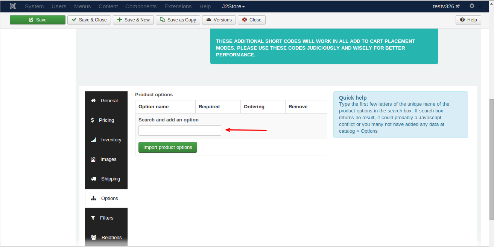
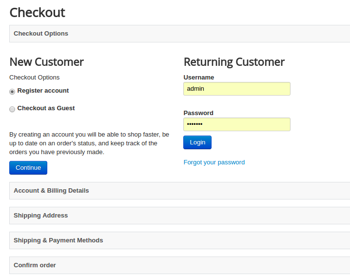
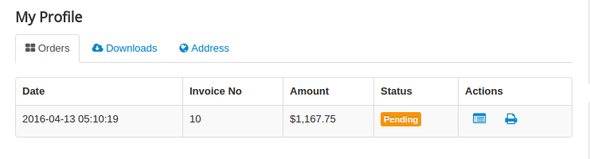

# Troubleshooting Common Issues

* **[Is making changes on product not saves ?](#article-not-saves)**
* **[[HOW TO]Fix enter your valid Address information Error](#valid_address_error)**
* **[Change default country in checkout](#change_default_country)**
* **[Order products in list layout](#order_products)**
* **[Options from dropdown cannot be selected](#options)**
* **[solve jQuery conflict with Multi-categories component](#multicateogries)**
* **[Writing template override for the frontend order view and print layouts](#template_override)**
* **[HOWTO make checkout address field labels language friendly](#checkout_field_language)**
* **[Selling Digital Goods Online with J2Store](#digital_folder)**
* **[Joom SEF configuration for J2Store](#joomsef)**
* **[How to Remove + and - Prefix in Product Option Price](#remove_prefix)**
* **[HOW To Translate the Address Field Labels](#translate_addr_fields)**
* **[HOW TO change the colour of add to cart buttons](#color_cart_button)**
* **[Writing a Layout override for Joomla article manager - An intro image](#override_intro_image)**
* **[HOWTO solve javascript conflict between some of RocketTheme templates and J2Store](#rocket_js_conflict)**
* **[How to translate payment option title](#payment_option_title)**
* **[Hiding Product Options And Cart Button In Category View](#hide_cart_button)**
* **[Override Product Layout](#override_product_layout)**
* **[HOW TO set up and enable SSL in Joomla](#enable_ssl)**
* **[How to solve the product link in search results](#j2store_search)**
* **[[HOW TO]Fix product you are trying to access is disabled](#product_disable_error)**
* **[Is your digital product showing NEVER in expiry column](#download-expiry-never)**
* **[[HOW TO]Solve terms and conditions popup box freeze](#terms-conditions)**

<a name="article-not-saves"></a>
## Is making changes on product not saves ?

Make sure you are not using the MySQL PDO driver of Joomla

Go to Global configuration -> Server -> Database settings.

Make sure the Database driver is either MySQL or MySQLi

> The PDO driver of Joomla has a bug (for a long time).

<a name="change_default_country"></a>
## [HOWTO] Change default country in checkout

1. Login to Joomla administrator and go to Components -> J2Store

2. Go to Set up - > Custom fields

3. Open the Country field and choose your default country. Save.

4. Open the Zone ID field and choose your default zone. Save.

5. Clear Joomla cache and check.

<a name="order_products"></a>
## [HOWTO] Order products in list layout
The product list layout by default takes the ordering in the Article Manager. However, you can change this ordering (on page load / refresh) via the Menu Parameters.

NOTE: This tutorial applies only for those using the J2Store's Product List Layout in Version 3. If you use the default article layouts, refer the Joomla documentation on ordering of articles.

Login to Joomla administration and open the menu that links your product list.

Under the Common Options tab, you can find Article Order parameter. There you can choose the ordering method.


<a name="options"></a>
## [HOWTO] Options from dropdown cannot be selected

This issue occurs when your site has two instances of the Jquery UI library.



**In Version 3:**

Go to Configuration - basic settings
Set the Load Jquery UI to Only Front End.
Save

**In Version 2 :**
Go to J2Store - Options - Basic settings
Set the Load Jquery UI to Only Front End.
Save.

<a name="multicateogries"></a>
## [HOWTO] solve jQuery conflict with Multi-categories component

If you are using the Multi-cateogies component (which adds the ability to choose more than one category for your articles), you might experience a jQuery conflict with J2Store. Here is a quick fix

Are you using Multi-categories component ?
If yes, then the issue comes due to loading of multiple Jquery UI instances.

Here is a quick fix

Open /administrator/components/com_j2store/helpers/strapper.php

Around line 33, you will find

$document->addScript(JURI::root(true).'/media/j2store/js/j2storejqui.js');

Change this to

if($mainframe->isSite()) {$document->addScript(JURI::root(true).'/media/j2store/js/j2storejqui.js');}

Save.
Logout. Clear browser cache and test.
This should fix the issue.

<a name="template_override"></a>
## Writing template override for the frontend order view and print layouts

This tutorial applies to J2store 3.x versions.

You will nedd to use your hosting CPanel file manager or an FTP client like filezilla to carry out the following tasks.

The following file control the display of order details in frontend.

orderitems.php = This controls the display the order details in email and invoice template(frontend order view)

Let us see how to override the orderitems.php

Copy /components/com_j2store/views/myprofile/tmpl/orderitems.php

to

/templates/YOUR_TEMPLATE/html/com_j2store/myprofile/orderitems.php

Edit the file /templates/YOUR_TEMPLATE/html/com_j2store/myprofile/orderitems.php

Make your changes / overrides. Save.

You need to do the same if you want to override

<a name="checkout_field_language"></a>
## HOWTO make checkout address field labels language friendly

In a multi-lingual Joomla site, the checkout step doesn't convert to other language and seems to still show in english. How to make it appear in your own language ?
Simple, just rename the custom field labels as follows and it will quickly consider picking the language strings from your local language pack.

Still if you do not see the translation, please check your language pack for the following strings and translate them in your language.

language file location /administrator/language/en-GB/en-GB.com_j2store.ini

J2STORE_ADDRESS_TYPE="Address type"

J2STORE_BILLING_ADDRESS="Billing Address"

J2STORE_SHIPPING_ADDRESS="Shipping Address"

J2STORE_ADDRESS_DETAILS="Address Details"

J2STORE_ADDRESS_FIRSTNAME="First name"

J2STORE_FIRST_NAME="First Name"

J2STORE_ADDRESS_LASTNAME="Last name"

J2STORE_LAST_NAME="Last Name"

J2STORE_ADDRESS_USER_ID="User ID"

J2STORE_ADDRESS_USERNAME="Username"

J2STORE_ADDRESS_LINE1="Address Line 1"

J2STORE_ADDRESS1="Address Line 1"

J2STORE_ADDRESS_LINE2="Address Line 2"

J2STORE_ADDRESS2="Address Line 2"

J2STORE_ADDRESS_CITY="City"

J2STORE_CITY="City"

J2STORE_ADDRESS_ZIP="Zip / Postal code"

J2STORE_ADDRESS_STATE="State"

J2STORE_ADDRESS_COUNTRY="Country"

J2STORE_ADDRESS_PHONE="Phone"

J2STORE_ADDRESS_MOBILE="Mobile"

J2STORE_ADDRESS_FAX="Fax"

J2STORE_ADDRESS_COMPANY_NAME="Company"

J2STORE_ADDRESS_TAX_NUMBER="Tax Number"

J2STORE_ADDRESS_ZONE="Zone / Region"

J2STORE_TELEPHONE="Telephone"

J2STORE_ADDRESS_EDIT="View/Edit Address"

J2STORE_SHOPPER_ADDRESSES="Shopper Addresses"

<a name="digital_folder"></a>
## Selling Digital Goods Online with J2Store

Selling ebooks, PDF, images and files online is easy with the J2Store Joomla shopping cart. Here is a step-by-step guide to set up your digital downloads.

#### Step 1: Let us create a folder on your site to upload the files

You can use your Hosting Providers CPanel File manager or an FTP client like FileZilla to access your web root (public_html / www / httpdocs )

Once you are in the web root, create a folder. Let us name it as: myfiles

#### Step 2: Protect the folder from outside access

**We do not want people to access this folder using their browser and download files. So let us protect this folder using a .htaccess file.**

Create a file called htaccess.txt in your computer and open it with your favorite text editor
Add the following lines to it

order deny, allow
deny form all

Save the file. Now upload it to the folder we just have created in our web root. In our example, it is **myfiles**

**IMPORTANT:** Rename it as .htaccess

All the files uploaded to this folder is now protected.

#### Step 3: Point J2Store to use the files in this folder.

Go to Joomla admin - j2store - Configuration - Basic settings.

In Folder path for digital goods, enter the name of the folder that contains your files. In our example, it is: myfiles

Save the configuration.

#### Step 4: Creating your first digital product

J2Store uses Joomla articles as products. So head to Joomla admin -> Article Manager and create an article.

Fill in the title, description, add an image and set all other fields and Save.

Go to J2Store cart tab and set all the fields and Save.

Now go to files tab in the navigation you can see Set product files button.


<a name="missing_currency_symbol"></a>
## Solving the missing currency symbol in your store

When you install, J2Store sets USD as the default currency. When store owners change the currency code, they often forgot to update their default currency in their store profile.

When you see the currency symbol missing, it is an indication that:

1. You have either changed the currency code or deleted the USD and then created a new currency for your country.

2. You forgot to reflect these changes in the Store profile.

Solution
Go to J2Store admin -> Set up - > -> configuration -> Store

Choose your Default Currency.

**IMPORTANT:**Hit the Save button. Even if you see your currency is selected by default, it may not be saved in the store profile database. Since it is the only currency available (you deleted the USD or any other currency), the dropdown list shows the first currency available.

So CLICK the SAVE button.

Still not seeing the Currency symbol, open your store again and click SAVE again.

<a name="joomsef"></a>
## Joom SEF configuration for J2Store

If you are using JoomSEF along with J2Store, you will need to make simple change in the configuration.

Go to JoomSEF configuration -> Advanced Configuration. Change the Set Page base href value to Yes - always use only base URL.

<a name="remove_prefix"></a>
## How to Remove + and - Prefix in Product Option Price

Store owners sometimes want to hide the + (PLUS) and the - (MINUS) prefix that is shown along with the product options. In J2Store Version 3, you turn off the price prefix with a switch.

#### Default Joomla article layouts (like Category blog layout):

Go to J2Store - Configuration - Product tab.

Set Product option price prefix to HIDE

Save

#### Product list layout:

If you use the J2Store's product list layout, then you will find a similar switch in the menu parameters.

Open the menu that links your product list layout and go to Common Options.

Set Product option price prefix to HIDE

Save


<a name="translate_addr_fields"></a>
## HOW To Translate the Address Field Labels

If you wanted to translate the Address field labels, you can enter your translation in the respective fields.
Go to Joomla admin -> J2Store -> Set up -> Custom Fields

Open the field, the label of which you want to change, and enter your translation in the label field.

#### Multi-lingual sites

if you are running multi-lingual site, you can enter a language constant in the label field.
Example: J2STORE_MY_FIELD_NAME

Then you can go to Language manager and create an Override
**IMPORTANT: Set the Filter to Administrator before you create an override.**

Click New

Language Constant: J2STORE_MY_FIELD_NAME

Text: Your translation

Check the For Both locations

Save.


You can repeat this steps for your second, third, and other languages.

You can use language strings in all the fields including Custom Error message, Option Titles (if field type is select, radio, checkbox).

<a name="color_cart_button"></a>
## HOW TO change the colour of add to cart buttons

A majority of those who wanted to change the colour of the buttons are using template with a template that does not support the Twitter bootstrap framework, which helps you make your site responsive.

We have added a name-spaced bootstrap css in the J2Store package. So if your template does not support bootstrap, J2Store will use the bootstrap CSS included in the package. If your template supports bootstrap, then J2Store will inherit your template style, without you changing any CSS.

The following is a guide to those who want to change the button colours

Open your template's css file located in /templates/YOUR_TEMPLATE/css folder.

At the end of the file, add the following CSS. Save the file. Clean your browser cache and joomla cache. Refresh.

#### Add to cart button
```css
.j2store .btn-primary {background: #FF0000 !important; /*this will change your button colour to red. You can change the hex colour code based on your choice */

color: #FFFFFF !important; /*this will change your text on the button to white. You can change the hex colour code based on your choice */

}
```

#### View cart button
```css
.j2store .btn-success {

background: #FF0000 !important;

color: #FFFFFF !important;

}

.j2store .btn-success:hover {

background: #FF0000 !important;

color: #FFFFFF !important;

}
```

#### Update button

```css
.j2store .btn-warning {

background: #FF0000 !important;

color: #FFFFFF !important;

}

.j2store .btn-warning:hover {

background: #FF0000 !important;

color: #FFFFFF !important;

}
```

<a name="override_intro_image"></a>
## Writing a Layout override for Joomla article manager - An intro image

Layout overrides is a feature introduced in Joomla 3. They provide more modularity for templates across views and avoid duplication of code for a same design.

Consider a situation In Joomla caregory blog layout, you have to make a Joomla Article intro image a hyperlink with the read more button link. If you are using prostar template you can use this below.

#### Step 1: Write a layout override

You can use a file manager in your Hosting Control panel or an FTP client like FileZilla for doing the following tasks.

Copy

JOOMLA-ROOT/layouts/joomla/content/intro_image.php


to

JOOMLA-ROOT/templates/<YOUR_TEMPLATE>/html/layouts/joomla/content/intro_image.php

#### Step 2: Edit the override layout

Find below code

```php
$params = $displayData->params; 
?> 
<?php $images = json_decode($displayData->images); ?>

<?php if (isset($images->image_intro) && !empty($images->image_intro)) : ?>

<?php $imgfloat = (empty($images->float_intro)) ? $params->get('float_intro') : $images->float_intro; ?>

<div class="pull-<?php echo htmlspecialchars($imgfloat); ?> item-image"> image_intro_caption): echo 'class="caption"' . ' title="' . htmlspecialchars($images->image_intro_caption) . '"'; endif; ?> src="/<?php echo htmlspecialchars($images->image_intro); ?>" alt="<?php echo htmlspecialchars($images->image_intro_alt); ?>" itemprop="thumbnailUrl"/> </div>

<?php endif; ?> 
```

Replace above code with following code

```php
$params  = $displayData->params;
    if ($params->get('access-view')) :
		$link = JRoute::_(ContentHelperRoute::getArticleRoute($displayData->slug, $displayData->catid));
	else :
		$menu = JFactory::getApplication()->getMenu();
		$active = $menu->getActive();
		$itemId = $active->id;
		$link1 = JRoute::_('index.php?option=com_users&view=login&Itemid=' . $itemId);
		$returnURL = JRoute::_(ContentHelperRoute::getArticleRoute($displayData->item->slug, $displayData->item->catid));
		$link = new JUri($link1);
		$link->setVar('return', base64_encode($returnURL));
	endif;
?>
<?php $images = json_decode($displayData->images); ?>
<?php if (isset($images->image_intro) && !empty($images->image_intro)) : ?>
	<?php $imgfloat = (empty($images->float_intro)) ? $params->get('float_intro') : $images->float_intro; ?>
	<div class="pull-<?php echo htmlspecialchars($imgfloat); ?> item-image"> 
	<a href="/<?php echo $link; ?>">
	image_intro_caption):
		echo 'class="caption"' . ' title="' . htmlspecialchars($images->image_intro_caption) . '"';
	endif; ?> src="/<?php echo htmlspecialchars($images->image_intro); ?>" alt="<?php echo htmlspecialchars($images->image_intro_alt); ?>" itemprop="thumbnailUrl"/>
	</a>
	 </div>
<?php endif; ?>
```

Once you have finished editing, save the changes. Now you are done.

**NOTE:** If something went wrong, just delete.

JOOMLA-ROOT/templates/<YOUR_TEMPLATE>/html/layouts/joomla/content/intro_image.php

and go to Step 1.

<a name="rocket_js_conflict"></a>
#### HOWTO solve javascript conflict between some of RocketTheme templates and J2Store

If you are using a RocketTheme template with the RokBox plugin, then you might have experienced a javascript conflict at the checkout steps.

One of our users Joe from Jgpproductions.com found the solution:

The rokbox has a new version RokBox2  and there is an option to use "backward compatibility"  that can be found in the plug in settings
```
If users take the steps to upgrade RokBox2 "correctly" and then turn off the "backward" option then J2store checkout steps will work good.
```
You can find the details to update rokBox here http://www.rockettheme.com/extensions-joomla/rokbox click on the DOCUMENTATION link on the right to get all the details on how to correct rokBox in older templates
```
NOTE: If you are upgrading from RokBox1 and you are using the old RokBox syntax, such as {rokbox} or <a rel="rokbox" >.., you can enable the Backward Compatibility from both the System and Content plug-in. You will also have to enable Backward Compatibility if you are using the Login or Module Popup Feature in any of our templates prior to Alerion. Those templates will be updated over time to be compatible with RokBox2 over time.
Be aware that the Backward compatibility can dramatically slow down the loading of your site. It is highly suggested to convert the old syntax into the new one.
```
  
<a name="valid_address_error"></a>
## [HOW TO]Fix enter your valid Address information Error
Are you using the USPS plugin ? If yes, open the USPS plugin and set the Address validation to No.
Save.

If the address provided is not in the USPS API's database, then it would throw this error. (Even if an extra space or typo in the address with throw the error.)

<a name="payment_option_title"></a>
## How to translate payment option title

It is possible and very easy to translate the payment option title for multilingual site.

Open your payment method and enter the language constant as a payment option title.

For example, J2STORE_MYCUSTOM_PAYMENTOPTION_TITLE

Then create language override for the constant **J2STORE_MYCUSTOM_PAYMENTOPTION_TITLE** and enter your language specific value.

**[Video tutorial on how to translate payment title](https://youtu.be/LYh1JBhCsTg)**

<a name="hide_cart_button"></a>
## Hiding Product Options And Cart Button In Category View

#### Do a Template Override

Copy
/components/com_j2store/templates/default/default_simple.php
/components/com_j2store/templates/default/default_variable.php
/components/com_j2store/templates/default/default_configurable.php
/components/com_j2store/templates/default/default_downloadable.php

to

/templates/YOUR-TEMPLATE/html/com_j2store/templates/default/

Find the below line in all the files
```php
<?php echo $this->loadTemplate('options'); ?>
<?php echo $this->loadTemplate('cart'); ?>
```

Replace this with
```php
<?php //echo $this->loadTemplate('options'); ?>
<?php //echo $this->loadTemplate('cart'); ?>
```
<a name="override_product_layout"></a>
## Override Product Layout

#### Layout file location

Go to /components/com_j2store/templates which contains two folders named **bootstrap3** and **default**(bootstrap2).

If you choose bootstrap3 as sub-template then you have to go with bootstrap3 folder.

If you choose default as sub-template then you have to go with default folder.

<a name="product_listing"></a>
#### Frontpage product listing files

Open your sub-template folder(/components/com_j2store/templates/YOUR-SUB-TEMPLATE) where you can find the files with name started with default_(for example, default_simple.php, default_images.php, etc). Those files controls all the features displaying in the category listing page.


**OVERRIDE PATH**
templates/YOUR-TEMPLATE/html/com_j2store/templates/YOUR-SUB-TEMPLATE/

<a name="product_view"></a>
#### Product view

Open your sub-template folder where you can find the files with name started with view_(for example, view_simple.php, view_images.php, view_options.php, view_notabs.php, etc). Those files controlled all the features displaying in the Product view page.


**OVERRIDE PATH**
templates/YOUR-TEMPLATE/html/com_j2store/templates/YOUR-SUB-TEMPLATE/

<a name="product_filter"></a>
#### File location of filter

Following files controls filter section,

/components/com_j2store/templates/YOUR-SUB-TEMPLATE/default_filters.php

/components/com_j2store/templates/YOUR-SUB-TEMPLATE/default_sortfilter.php

**OVERRIDE PATH**
templates/YOUR-TEMPLATE/html/com_j2store/templates/YOUR-SUB-TEMPLATE/

<a name="cart"></a>
#### Cart page

Cart page is controlled by the files located in the follwing path /components/com_j2store/views/carts/tmpl


**OVERRIDE PATH**
templates/YOUR-TEMPLATE/html/com_j2store/carts/

<a name="checkout"></a>
#### Checkout page

Checkout is controlled by the files located in the follwing path /components/com_j2store/views/checkout/tmpl


**OVERRIDE PATH**
templates/YOUR-TEMPLATE/html/com_j2store/checkout/

<a name="myprofile"></a>
#### Order history page

Order history page is controlled by the files located in the follwing path
/components/com_j2store/views/myprofile/tmpl


**OVERRIDE PATH**
templates/YOUR-TEMPLATE/html/com_j2store/myprofile/

<a name="enable_ssl"></a>
## HOW TO set up and enable SSL in Joomla?

Most of the Joomla web shop owners want their site to be secure. By installing and enabling SSL in Joomla,

you can protect your site and your customers from some exploits. When you are running an e-commerce site, you will be getting customer information that has to be kept confidential.

Adding an SSL certificate and enabling it on your Joomla! site will allow customers to log in with the secure “https” protocol instead of the standard “http” prefix. You can turn SSL on for Administrators only,  for the whole site (recommended) or selected pages.

**IMPORTANT**: You should request your Web Hosting Provider to install and enable the SSL certificate before you follow the steps mentioned below.

#### Method 1: Enabling SSL for the entire site

Navigate to Global Configuration -> Server -> Force SSL : Entire site. Click Apply/Save. This will force SSL for your entire website, both Administrator and front end.
If you don’t have SSL enabled for your domain name, you will immediately get an error upon saving.

Please note!: The Joomla!  global configuration allows you to configure SSL, but if a visitor enters a Joomla!  page through non-HTTPS (I mean “old” URLs), this visitor is not automatically redirected.

Using a text editor open the configuration.php file from your site and find this line,
var $live_site =”;

Replace it with:

```php
var $live_site = 'https://www.your-site.com';
```
Then go to your .htaccess file and add these lines to the end of the file:

```php
RewriteEngine On
RewriteCond %{HTTPS} off
RewriteRule (.*) https://%{HTTP_HOST}%{REQUEST_URI}
```

#### SSL for selected pages

You would have to use a plugin to enable SSL for selected pages. There is a couple of plugins that makes the job easy for you. Yireo SSL Redirection plugin is one of them. You get the plugin from [here](http://extensions.joomla.org/extensions/extension/site-management/url-redirection/yireo-ssl-redirection)

Before experimenting with SSL, please keep in mind that it may affect your site loading speed. Because, serving HTTPS traffic costs more in resources than HTTP requests.

NOTE: If you are using the Yiero plugin, then you should include the J2Store component for SSL. Otherwise you might face issues.

The following article published in the Joomla Magazine throws light on the advantages and disadvantages of SSL. Read it before you implement SSL in your website. [Read it](http://magazine.joomla.org/issues/issue-jan-2013/item/1023-how-ssl-can-secure-and-add-features-to-your-joomla-site)

<a name="j2store_search"></a>
## How to solve the product link in search results

When you are searching product using joomla search, clicking on product name in the search results will not take you to the J2Store product view.

**SOLUTION**
By default, J2Store has Search plugin included in the package so go to **Extensions -> Plugins** and choose type **Search**.

You can find the plugin Search - J2Store.


Enable / open the plugin and setup the configurationsas like in the below screenshot.


<a name="product_disable_error"></a>
## [HOW TO]Fix product you are trying to access is disabled

There 3 reasons behind this warning message.

1. If the product you are trying to access is the variable product and you have not yet generated the variants for that product, this kind of warning message will be shown.
2. You might be having same alias name for the two products.
3. Alias name of the product might be in number.

<a name="download-expiry-never"></a>
## Is your digital product showing NEVER in expiry column?

When you change the order status to confirmed manually, you will have to do the below,

Go to J2Store > Sales > Orders
Open the order
On the left side of order history page, check the checkbox **Reset download access expiry date** and save.


<a name="terms-conditions"></a>
## [HOW TO]Solve terms and conditions popup box freeze

Sometimes, the terms and conditions pop up modal box gets freezed and it does not allow you to do anything with that.

This issue is due to choosing of wrong layout for checkout pages. Following the solutions given below

**Solution**

Go to J2Store > Configuration > Basic settings tab
Choose Bootstrap 3.x to Cart and checkout pages should use CSS classes
Save.

If it is already set to bootstrap 3.x, change to bootstrap 2.x and check.

<a name="invoice-logo"></a>
## How to add your business logo to the invoice and email template ?

Many of you tried adding image in your invoice and email template text editor, but it fails to show it in order invoice and email.

While inserting image, you should have to give a full url for the image source path in toggle editor. For example,
```html

```
Edit your invoice or email template
Turn on your toggle editor
Give full url for your image source path
Save and close without toggle back to text editor.

**NOTE:** Please use **JCE editor** as you default editor. TinyMCE editor changes the full url when saving changes and the logo not appears.

## How to create additional order statuses ?

Do you want to create additional order statuses like shipped, delivered, paid, etc. ? 

Go to J2Store >Localisation > Order statuses
Click New
Enter your status name and label class name
Choose Enable
Save.