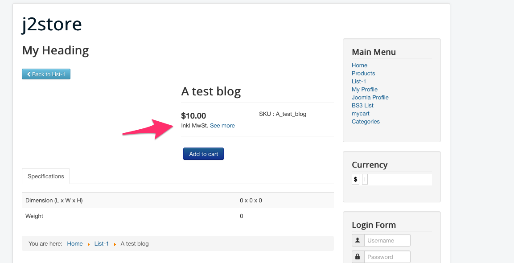

# Troubleshooting Tax Issues

* **[How to display Prices without including tax?](#price_without_tax)**
* **[How to display prices with including tax?](#price_with_tax)**
* **[Why the tax rate is not showing up for particluar zone?](#zone_not_showing)**
* **[Configured all the things properly but still tax is not showing.Why?](#add_tax_profile)**
* **[Why tax is not displayed when changing the setting of the tax calculation from billing address to the delivery address?](#change_shipping_address)**
* **[Why tax information is showing as "Excl.tax even you have chosen including tax in configuration ?](#wrong_tax_information)**
* **[HOW TO Apply tax to all customers comes from world wide ?](#world-wide-tax)**
* **[[How To]Display tax information with follow link text ?](#tax-info-with-link)**

<a name="price_without_tax"></a>
#### How to display Prices without including tax?

Go to J2store -> Configuration -> Tax tab.

Select **No, I will enter prices exclusive of tax** to Prices Entered With Tax option.

Select **Excluding tax** for both Display prices in product pages and Display prices during cart/checkout.

<a name="price_with_tax"></a>
#### How to display prices with including tax?

Go to J2store -> Configuration -> Tax tab.

Select **Yes, I will enter prices inclusive of tax** to Prices Entered With Tax option.

Select **Including tax** for both Display prices in product pages and Display prices during cart/checkout.

Set **YES** to Display tax information below the prices (in product pages).

<a name="zone_not_showing"></a>
#### Why the tax rate is not showing up for particular zone?

For example, do you want to setup the tax rate for california ?

* ***First thing is you have to create Geozone for california***

  Go to J2store -> Localisation -> Geozones and click **NEW** button on top left.
  
  Enter the Geo Zone Name in the text box.
  
  Select **Enable**.
  
  Click on Add Country/Zone button then you will get two dropdowns for choosing country and zone.
  
  Choose the country name and zone name from the dropdown list.
  
  Click Save & Close.
  
* ***Add the Geozone to the tax rate you have created***

  Open the tax rate you have created and the geozone you have created will be listed in the Geo Zone list.
  
<a name="add_tax_profile"></a>
#### Configured all the things properly but still tax is not showing.Why?

You might have missed one most important step. You should add the tax profile to the product.

Open the product, go to J2Store cart and navigate to the general tab.

Add your tax profile created.

<a name="change_shipping_address"></a>
####  Why tax is not displayed when changing the setting of the tax calculation from billing address to the delivery address?

If you choose shipping address in J2Store Tax configuration then you should also change the associated address to shipping address in the tax profile.

Go to tax profile and set the associate address as shipping address.

<a name="wrong_tax_information"></a>
#### Why tax information is showing as **"Excl.tax"** even you have chosen including tax in configuration ?

Seems to be choosing of wrong default customer address.

In your tax configuration, you might have chosen default customer address as **"No address"**. Here should choose store address as default customer address.

Because, the guest customers don't have any billing or shipping address so in this case, it will take default address as store address to display the correct tax information.

<a name="world-wide-tax" />
#### HOW TO Apply tax to all customers comes from world wide?

It is very simple. Just create one geozone and include all countries.

Go to J2Store > Localisation > Geozones
Click New
Enter Geozone name and choose the status Enabled
Save.

After saving, you can see Import countries button. Click Import countries button to import all countries and save.

Now assign this geozone to your tax rate.

<a name="tax-info-with-link" />
#### [How To]Display tax information with follow link text ?

##### Step-1 Enable tax information to be displayed on product page

Go to J2Store -> Configuration - Tax settings
Set Display tax information below the prices (in product pages) to YES.
See the screenshot below


It would display a text like this: (Incl. XX% tax )

This might be in English.

You can change this with a language override for below language constant
Language constant is: J2STORE_PRICE_INCLUDING_TAX

##### Step-2 Creating language override

Go to Extensions -> Language(s) -> select Overrides.

Choose your language(For example, English(en-GB-Administrator)) in filter section and click new on top left.

Add J2STORE_PRICE_INCLUDING_TAX in Language constant text box.

In Text box, add **Inkl %s MwSt (add the link using html anchor tag)**. For example, 
```html
Inkl %s MwSt. <a href="yoursite.com">See more</a>
```

Check For both locations.

Location should be administrator.

Save and close.

Here is a screenshot showing the language override


Here is how it looks in the front end

