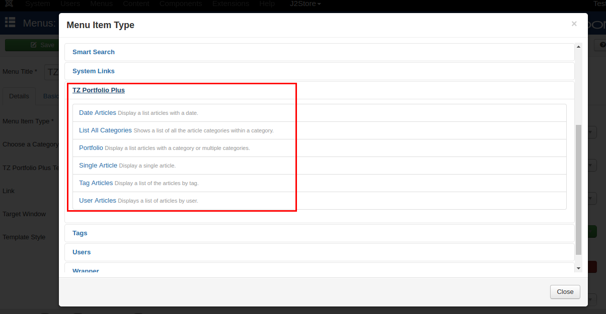

# TZ Portfolio

Now J2Store integrates with TZ Portfolio Content Management System. Lets start creating portfolio as J2Store Products.

#### Requirements

1. PHP 5.4 or higher

2. Joomla 3.x

3. J2Store 3 or above

4. TZ Portfolio Plus (Components, modules, plugins)

#### Installation

1. Download the TZ Portfolio Plus from Joomla Extension Directory.

2. Install the downloaded TZ Portfolio package using Joomla Installer.

3. Once installed TZ Portfolio Plus, download and install the J2Store TZ Portfolio integration.

4. After installing J2Store TZ Portfolio integration, 
  * Go to Extensions > Plugins
  * Choose the Search type **Content**
  * Enable Content - TzPortfolio - J2Store plugin

#### Backend (Creating Portfolio)

1. Go to Components > TZ Portfolio

2. Select Field groups and click on **NEW** button to create new field group.

3. Enter the name, add the description and set the status to **Published** and save the Group Field.

4. Open the Group Field which has just been created and go to the tab **Categories Assignment** and assign the group field to the category.

 If you assign the group field to the category, this group field will be applied to the articles belonging to that assigned category when you select "Inherit Category".
 
5. Now Select **Articles** and click on **NEW** button to create new articles.
 * Enter the Article title
 * Choose the category
 * Set the status to Published
 * In the article right menu pane, choose J2Store Cart.
 * Select **YES** to Treat as a Product and choose the product type.
 * save

6. Once Saved, now you can able to set product price, images, options,etc.

#### Frontend

It is very simple to show your portfolio artciles in the frontend.

1. Enter the menu title.

2. Go to Menu Manager and add a new menu item type with TZ Portfolio > Date Articles or TZ Portfolio > Portfolio.

3. Choose the category and set the status to **Published** and save.

4. Now go to the site and check the menu you have created.
