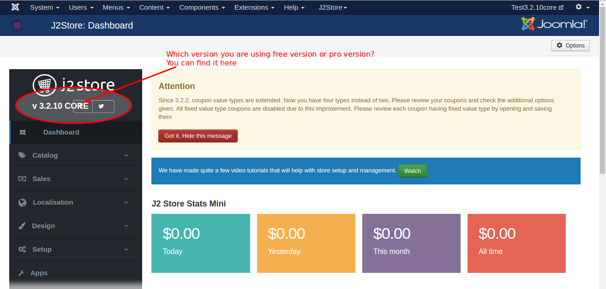

#Upgrade J2store Free version to Pro version

You can check which version of J2store you are using. Just Go to J2store > Dashboard where you can find the version of J2store. Please refer the image below.



####How to upgrade the J2store Free version to Pro version ?

If you have login and you are in the subscribers list, please go to this link http://j2store.org/my-downloads.html and download the **J2store Pro Package**.

Once you downloaded, now go to Joomla installer and install the J2store Pro Package over it.

```
Very Important : Before you start installing J2store Pro package, you must take your site backup using Akeeba Backup Component.
```
```
Note : By installing the J2store Pro version over the Free version, **your content will not be lost**
```