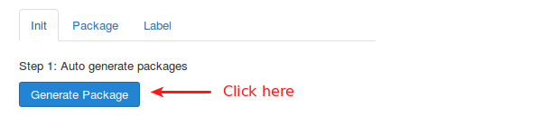
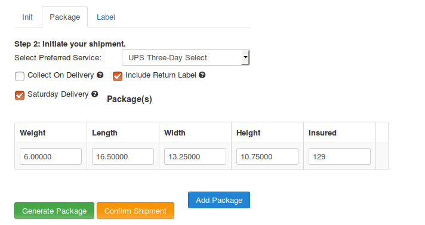
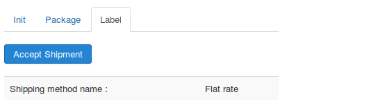
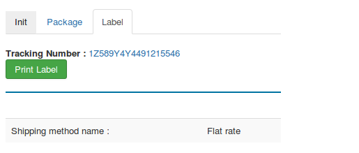
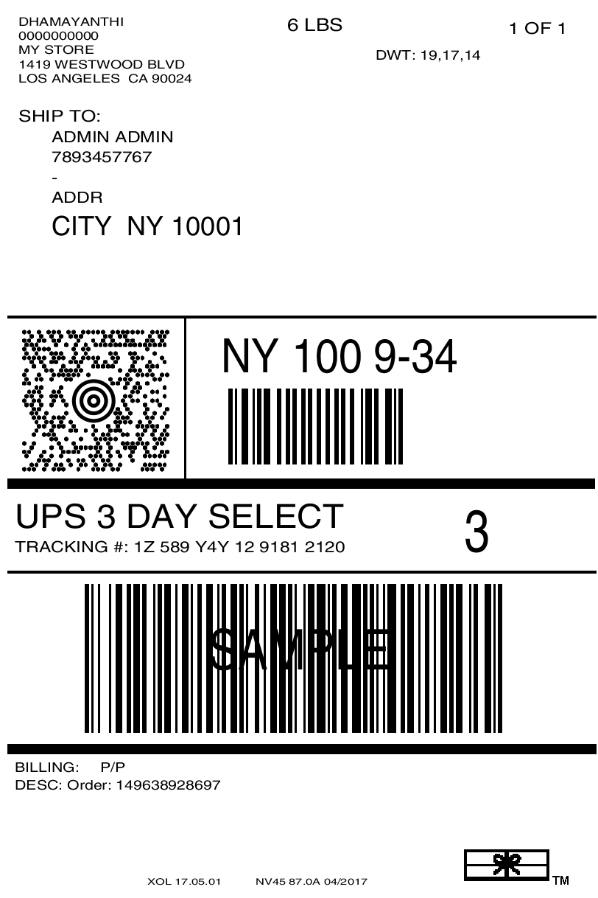

# UPS labels

This app integrates UPS Label APIs to print domestic and international shipping labels with a tracking code.  The plugin sends shipment details to your UPS online account and generates the shipping label (GIF/PNG/ZPL/EPL), which you can print by clicking the Print Label button.

It also provides an option to change the shipping service and box/parcel dimensions manually before generating the label 

### Requirements

1. PHP version 5.4 +

2. Joomla 3.3.x +

3. J2Store 3.2.22 and above.

### Installation

1. Download and install UPS Labels from our site's extensions section and install it using Joomla installer.

2. After installing the ap, go to J2Store > Apps and click Enable on UPS Labels.

3. Once activated, click on open to configure basic settings of the app.

### Configuration

**UPS Packaging type** 

Choose UPS packing type here. UPS will provide 2 types of parcel packing methods.

1. Items Individually

2. Box Packing

* **Items Individually**
    Each product considers as a separate unit and packing it into the individual boxes. Each product will be packed separately.
* **Box Packing**
    The box packing included with this shipping method lets you group items into packages for which you have to define height, width, length, weight and max weight. Packing is mainly volume based but also considers item size.

**UPS Packaging Box**

UPS Packing box offers more box packing tyoe which are listed here. You have to choose/select more than one option from the list.

**Box List**

If you select the packing method as Box packing means you should configure the box otherwise no need.

**Sandbox Mode**

UPS Labels also offers sandbox feature to test printing shipping labels. Set this option to **YES** to enable sandbox mode.

**Access key/Access Licence number**

Enter the access key provided by the UPS.

>Not sure where to find your Access key ? Read the documentation below https://help.extensionworks.com/hc/en-us/articles/200366638-Where-do-I-find-my-UPS-license-key-or-Access-Key-

**UPS username**

Enter the username provided by UPS. If you would like to use sandbox mode, enter your sandbox account's username.

**UPS Password**

Enter the password associated with your UPS account. If you would like to use sandbox mode, enter your sandbox account's password.

**Account Number**

This is actually the shipping account number provided by the UPS.

**Weight and length unit**

set the Weight Unit as **Pound** and Length Unit as **Inch for USA** , others country set Weight unit as **Kilogram** and Length unit as **Centimeter**.

**Label Type**

It specifies the image type for the returned label. You can print shipping labels in following formats (GIF/PNG/ZPL/EPL).

Below options are common settings. This address is used as 'return address' on your printed labels. Enter your origin address (source addess), which is used as the store location for calculating shipping rates. The address and details you given here should be valid.

**Company Name**

Enter the name of your store or company.

**Origin User Name**

Enter the full name of store owner.

**Origin Address and City**

Enter the valid addresses and city of your store location.

**Origin Zip**

Enter the valid zip code here.

**Origin Phone number**

Enter your contact number here.

### How to print shipping labels ?

Requesting and printing shipping labels is done from the backend order history page. To get started, you first need to view/edit an order in the backend. From Joomla backend, go to J2Store > Sales > Orders and view/edit an order.

1. Click on **Generate Package**

2. **Package**

    Choose your preferred service and delivery option and then click **confirm shipment** button.

3. **Accept shipment**

    Click on accept shipment method to get the tracking number and print label button.

4. **Print label**

### Sample Lable

{: width: 450px}