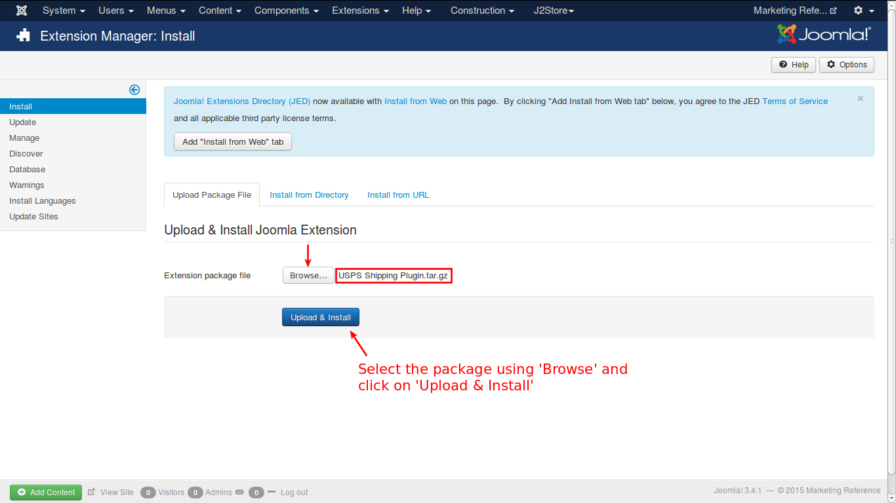
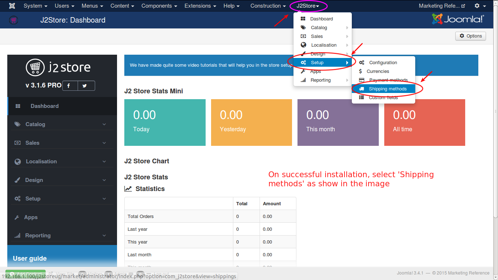
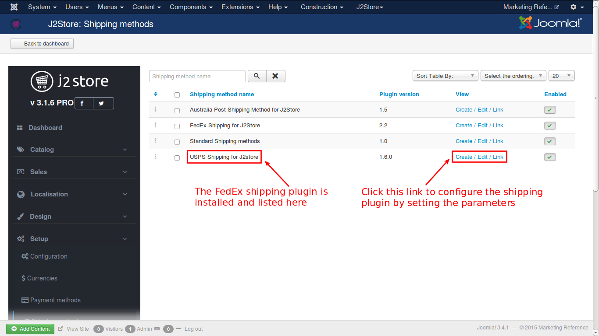
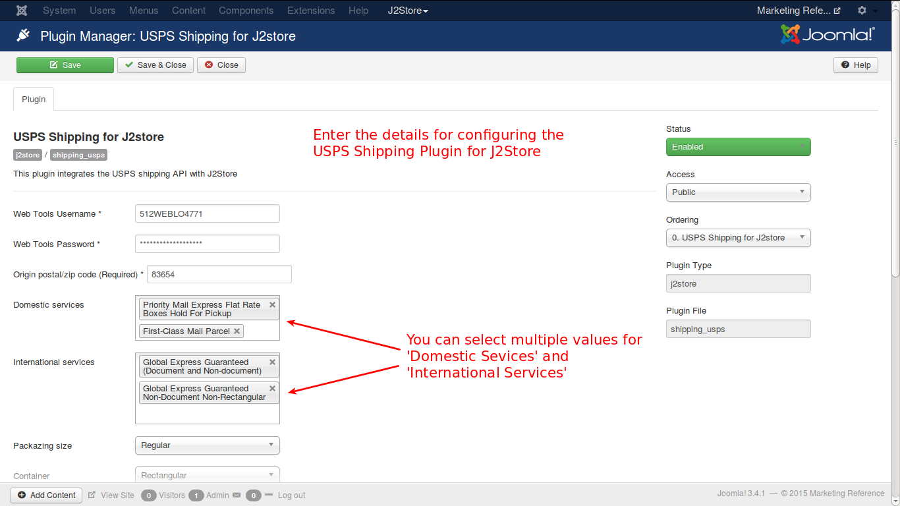
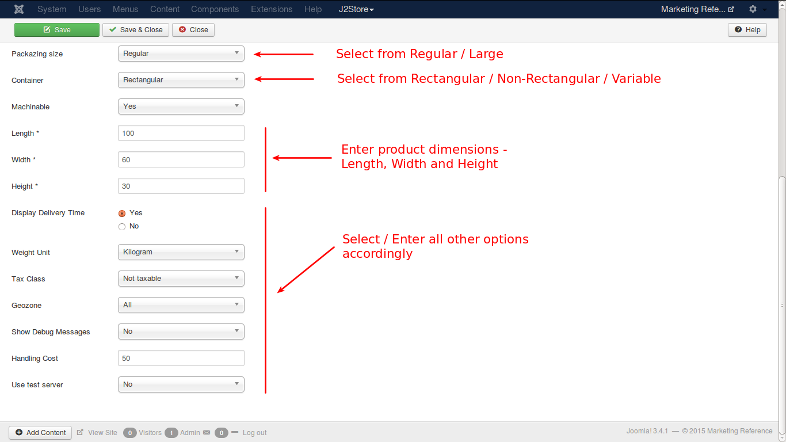

# United States Postal Service Shipping Plugin

This plugin integrates J2Store with USPS Shipping rate API.

### Requirements
* **PHP 5.2 or higher**
* **Joomla 2.5 or above**
* **J2Store 2.7.3 or above**

### Installation
You can install this shipping plugin, using joomla installer.

1. In the J2Store admin, go to **Extensions -> Extension Manager**
2. Click on the *Browse* button and select **USPS Shipping** (type=j2store) and click on *Upload & Install*
3. Enable the plugin
4. Configure the shipping plugin by entering the plugin parameters
 

### Parameters

##### 1. Web Tools Username
This is the username you have used in web tools account. You have enter it here. 

##### 2. Web Tools Password
Enter the web tools account password here.

**Don't know how to get API credentails ?** Please register here:
https://www.usps.com/business/web-tools-apis/welcome.htm

As soon as you register, USPS will send you an email with the API keys. You need to enter them in the plugin parameters.
> And make sure the Test mode field is set to NO in the plugin parameters.

##### 3. Origin Postal Code
Enter the postal code from where the shipping is actually made.

##### 4. Domestic Services
You have a lot of domestic services offered by USPS. You can select more than one service.

##### 5. International Services
Like domestic services, there is a lot of International Services also provided by USPS. You can select multiple services.

##### 6. Packaging Size
There are two packagign sizes. **Regular** and **Large**. Any one can be selected.

##### 7. Container
This option has three values. **Rectangular, Non-Rectangular** and **Variable**.

##### 8. Machinable
Select **Yes** or **No**

##### 9.Length
The length of the package or box, in the given units (mm, cm or inches).

##### 10. Width
The width of the package or box, in the given units (mm, cm or inches).

##### 11. Height
The height of the package or box, in the given units (mm, cm or inches).

##### 12. Display Delivery Time
If you want to display the delivery time, select **Yes** in this option.

##### 13. Weight Unit
Select the desired unit in which you want to measure the weight, like, kilograms, pounds etc.

##### 14. Tax Class
If shipping is taxable and you want to add tax rate, select a tax profile in this option.

##### 15. Geozone
If you want to limit this shipping method to particular areas, then you can select the corresponding geozone in this option. If this shipping is applicable to all areas, then set it to **All**.

##### 16. Show Debug Messages
If you set this to **Yes**, then an error log file will be maintained in the cache folder. It suitable for test account.
>Set this option to **No** in live site

##### 17. Handling Cost
If you need to charge a handling cost for the shipping, you can provide it here.

##### 18. Use test server
USPS Shipping offers a testing suite called test server. Before going live, you can test your store using USPS test server feature.

### Support
If you still have questions, you can reach us in **support@j2store.org**

Thankyou for using our extension.

