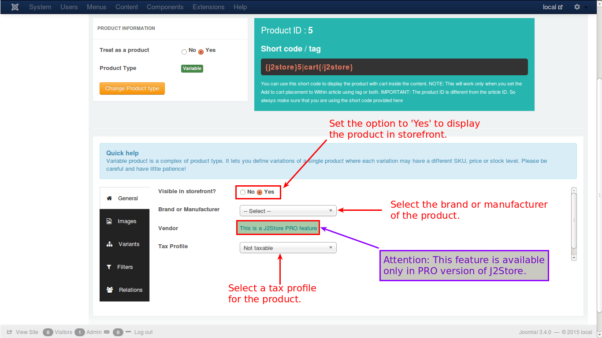

# General

Variable product is a complex product type and one need to be careful in configuring this product. In this general tab, lets see how it goes with the help of an image.

* **Visible in Storefront** - First select whether the product is to be displayed in front of the store. If it is, set the option to **'Yes'**
* **Brand or Manufacturer** - Select the brand or manufacturer of the product from the available list
* **Vendor** - Select the vendor from whom the product is available for purchase - ***This is J2Store PRO feature***
* **Tax Profile** - Specify whether the product is taxable and if it is, select the taxprofile relevant to the product
