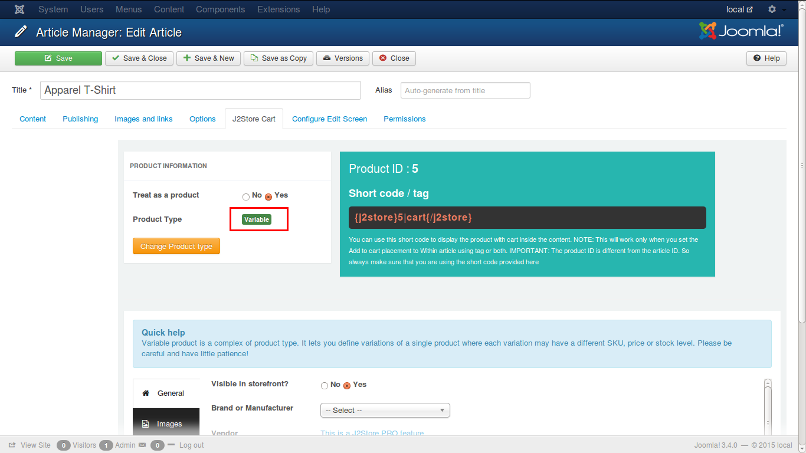

# Variable Product

A variable product has some features varying from other items of the same product, for e.g., a T-Shirt is a variable product, by color, size, stock, price, etc. Each variation can have different properties and prices.

### Create a variable product
There are several tabs in which the details of the product have to be given under various classifications. The tabs are:

* **[General](./assets/images/http://j2store.gitbooks.io/user-guide/content/variable_general.html)**
* **[Images](./assets/images/http://j2store.gitbooks.io/user-guide/content/variable_images.html)**
* **[Variants](./assets/images/http://j2store.gitbooks.io/user-guide/content/variable_variants.html)**
* **[Filters](./assets/images/http://j2store.gitbooks.io/user-guide/content/variable_filters.html)**
* **[Relations](./assets/images/http://j2store.gitbooks.io/user-guide/content/variable_relations.html)**
