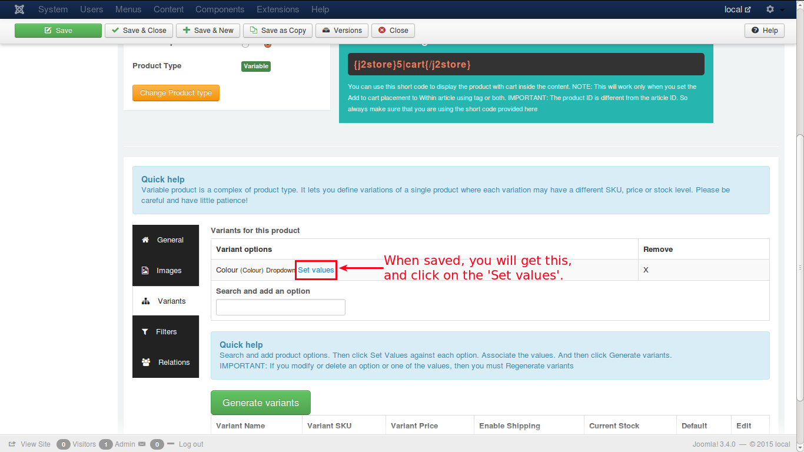

# Variants

Variants are products of same type and nature but with different attributes. For e.g., consider a Laptop of a particular brand with certain attributes, say
* **Colour - Metallic Grey**
* **Screen - 15.6 inches**
* **RAM    - 2 GB**
* **HDD    - 500 GB**
* **SKU    - MTG8620**

and so on. Now, the same product with same brand, will be a variant from this with some attributes changed, like
* **Colour - Black**
* **Screen - 15.6 inches**
* **RAM    - 2 GB**
* **HDD    - 500 GB**
* **SKU    - BLK8640**

For both the items, brand and model name may be same, but the attributes like colour and SKU differs. These are two variants of a particular laptop brand.

* A variant defines how this product differs from other products of same type
* It may be SKU no, price, stock level or color

Lets discuss it with some image illustrations:

If you select 'Colour' from the list, your screen will look like this:

You can see the option you have selected from the list added down there. Now, save the form to proceed.

You can see '**Set Values**' near the option name **Colour** and click it. You will get a pop-up window to add attributes as illustrated below:

Once you are done, save changes and close the pop-up window to get back to the main window. Now you have set the values for the variants to be generated. Why wait, just go and generate the variants like this:

The button you have clicked for variant generation will adjust itself to show you a message, 'Generating variants... Please wait' and that's it. You have your variants generated! Wonder how? Just check the image below for a surprise...

