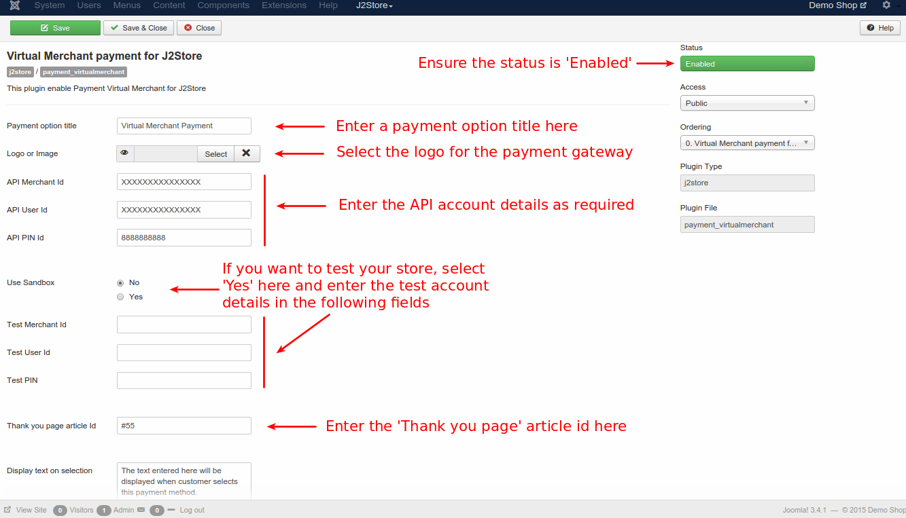

# Virtual Merchant Payment Plugin

### Introduction

This plugin integrates J2Store with Virtual Merchant payment gateway, thus facilitating users who prefer Virtual Merchant to pay online.

### Requirements

* PHP 5.2 or higher
* Joomla 2.5 or above
* J2Store 2.7.3 or above

### Installation

1. Use Joomla installer to install the plugin.
2. At the backend, joomla control panel, go to **Extension -> Plugin Manager** and open the **Virtual Merchant** (type = j2store).
3. Enable the plugin.
4. Enter the plugin parameters.

### Parameters

You can configure the payment plugin with the help of the images below:

1. **Payment Option Title** - 
    Enter Option Title here. This text will be displayed while listing the payment option.

2. **Logo or Image** -
    This option is used to display the payment plugin logo in the checkout page.

3. **API Merchant ID** -
    Here, you have to enter the API Merchant ID associated with Virtual Merchant account. 

4. **API User ID** -
    Here, you have to enter the API User ID associated with Virtual Merchant account. 

5. **API PIN** -
    Here, you have to enter the API PIN associated with Virtual Merchant account. 

6. **Use Sandbox** -
    This is for testing purposes. Before going live, you can test your store using sandbox mode.
There are two options allowed here.
    * **Yes** - Set in demo accounts for testing purposes
    * **No** - Set in live accounts
>**Note** - In live site, this should always be set to **NO**

7. **Test Merchant ID** -
    Here, you need to enter the Test Merchant ID, that is associated with Virtual Merchant demo account. 

8. **Test User ID** - 
    Here, you need to enter the Test User id, that is associated with Virtual Merchant demo account. 

9. **Test Merchant ID** - 
    Here, you need to enter the Test PIN id, that is associated with Virtual Merchant demo account. 

10. **Thankyou Page Article ID** -
    If you want to display thankyou message, you need to enter the article id here. The message will be displayed after payment completion page.

11. **Display Text on Selection** -
    The text entered here is displayed when a customer selects this payment method. You can enter a language constant as a value here, if you are using a multi-lingual site and then write a language override. Refer the tips below:
>Tip -
ONLY FOR MULTI-LINGUAL SITES -
For example, enter a language constant :
>**J2STORE_TEXT_TO_DISPLAY_ON_SELECTION**. 
>Now you can go to **Joomla admin -> Language Manager -> Overrides** and create overrides for the language constant in all languages.  

12. **Display text before payment** -
    The text entered here is  displayed to the customer at the order summary screen, before the customer makes the payment. 
You can enter language constant as a value here, if you are using a multi-lingual site and then write a language override. Refer the Display text on selection param.

13. **Display text on after payment** -
    The text entered here will be displayed to the customer after he makes the payment. You can enter a language constant as a value here if you are using a multi-lingual site and then write a language override. Refer the Display text on selection param.

14. **Display text on error in payment** -
	The text entered here is displayed to the customer when there is an error in the payment process.
	You can enter a language constant as a value here if you are using a multi-lingual site and then write a language override. Refer the Display text on selection param. 

15. **Display text if customers cancels payment** -
	The text entered here will be displayed to the customer when he cancels the payment at the gateway (NOT in your site). 
	You can enter a language constant as a value here if you are using a multi-lingual site and then write a language override. Refer the Display text on selection param.

16. **Payment button text** -
	The text of the payment button. The button will be displayed at the final checkout step. 

17. **Debug** -
	This option is used to enable/disable log file.

### Support

Still have questions? You can reach us in ***support@j2store.org***

Thankyou for using our extension.

