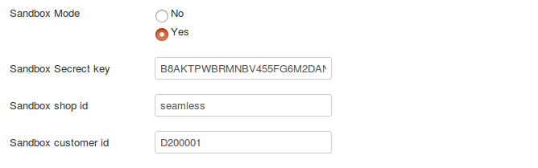

# Wirecard payment gateway

This plugin integrates Wirecard payment gateway integration with Joomla J2Store eCommerce solution. This makes it possible to accept more than 15 types of payment methods, including PayPal, GiroPay, iDeal, PaySafe Card, SEPA, SOFORT, etc.

#### Installation

1. Download Wirecard payment from our site and install it via Joomla installer.

2. After installing the plugin, go to J2Store > Setup > Payment methods and enable Wirecard Payment for J2Store.

3. Once activated the plugin, open and configure the basic settings of the app.

#### Test card details

**Credit card:**
PAN: 9500000000000001
Ex.Month: 12
ex.year: 2031
verify code: 123
holder name: Jane Doe
issue Month: 01
issue Year: 2013
issue Number: 1234

**SEPA:**
Bic : ABC1234567
iban:1234123412341234
accountOwner: John Doe

**giropay:**
accountOwner: John Doe
bankAccount: 1234567890
bankNumber: 99000001

**paybox:**
payerPayboxNumber:0123456789

voucherId:0123456789

#### Configuration

* **Payment option title**
    
    This controls the title displayed during checkout payment step.
    
* **Plugin Display Image**

    The image added here will be displayed along with payment title during checkout payment step.
    
* **Secret key**

    Setup wirecard account and find your account's secret key and paste here.
    
* **Shop id**

    The shopID parameter is used to identify the shop page if multiple layouts are being used under one customer number.
    
* **Customer id**

    Enter the customer id associated with your wirecard account.
    
* **Sandbox mode**

    The wirecard payment offers sandbox feature to test your store. To enable sandbox mode, set this option to YES.
    
* **Sandbox Secret key and Sandbox customer id**

    To use wirecard in sandbox mode, you can use default API credentials that is entered by the plugin.
    
    
    
* **Display payment list**

    Choose the payment methods that you can offer to your customers. 
    
* **Article ID for thank you message**

    You can create a Joomla Article to say thanks to the users, who purchased in your online store. Enter the article ID here.
    
* **Geozone**

    By selecting a geozone here, you can restrict this payment method to only customers of that geo-region. Choose All geozones to show this method to all customers.
    
* **Display text on selection**

    The text entered here will be displayed when customer selects this payment method. You can enter a language constant as a value here if you are using a multi-lingual site and then write a language override. For example, enter a language constant:

    J2STORE_TEXT_TO_DISPLAY_ON_SELECTION.

    Now you can go to Joomla admin-> Language Manager->Overrides and create overrides for the language constant in all your languages.
    
* **Display text before payment**

    The text entered here will be displayed to the customer at the order summary screen before he makes the payment. You can enter a language constant as a value here if you are using a multi-lingual site and then write a language override. Refer the Display text on selection parameter.
    
* **Display text on after payment**

    The text entered here will be displayed when customer completes the payment.

    You can enter a language constant as a value here if you are using a multi-lingual site and then write a language override. Refer the Display text on selection parameter.
    
* **Display text on error in payment**

    The text entered here will be displayed to the customer when there is an error in the payment process.

    You can enter a language constant as a value here if you are using a multi-lingual site and then write a language override. Refer the Display text on selection parameter.
    
* **Display text if customers cancels payment**

    The text entered here will be displayed to the customer when he cancels the payment at the gateway (NOT in your site).

    You can enter a language constant as a value here if you are using a multi-lingual site and then write a language override. Refer the Display text on selection parameter.
    
* **Payment button text**

    Text entered here will be added as the name of the payment button.

    You can enter a language constant as a value here if you are using a multi-lingual site and then write a language override.
    
* **Debug**

    Choose YES to enable the debug mode. If you set this to yes, then debug messages will be logged and saved in the cache folder in your Joomla root directory. DO NOT select YES in the live site. 
    
