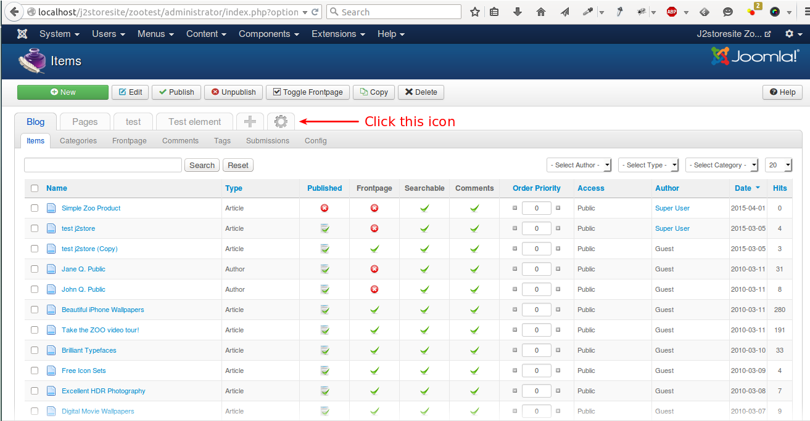
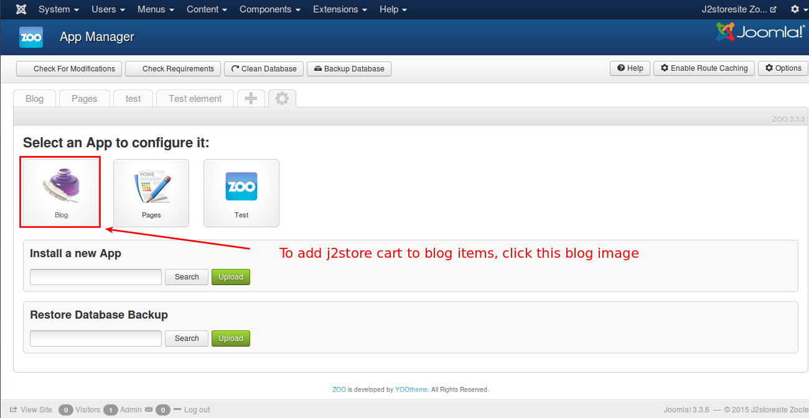
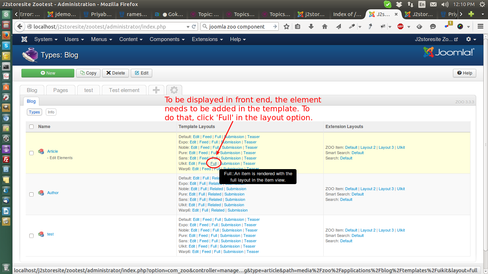
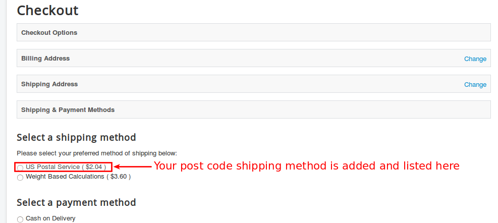

# Zoo

### Introduction

The plugin integrates Zoo content construction kit with J2Store, thus adding ecommerce capability to zoo. 

#### Requirements
* PHP 5.2 or higher
* Joomla 3.x
* J2Store 3 or above
* Zoo 
* j2store_zoo_unzip_first(Extract this package to get installation packages )
    1. Item J2Store ( plg_itemjtwostore )
    2. System Zoo J2Store ( plg_system_zooj2store ) 

#### Installation Instructions 

###Note:
When you download the Zoo Plugin You will have the package named "j2store_zoo_unzip_first", if you unzip the package you will find two zipped package .These two package are most important and need to be installed and to be enabled.

1. Unzip the Package "j2store_zoo_unzip_first.tar.gz" download from the site.Now, you will have two packages plg_itemjtwostore.tar.gz, plg_system_zooj2store.tar.gz.
 
2. Use the Joomla Extension manager to install both the  plugins one by one. 
 
#### Enable System Zoo J2Store Plugin

1. Go to Extensions->Plugin Manager -> Select the Plugin "System Zoo J2Store"  and enable the System Plugin.

#### Enable Item J2store in Zoo 
2. In the backend, go to Components -> Zoo. Click on the Setting Icon.
 

Let us say, you want to treat a Blog item as product. (Zoo has a number of other content types as well. Blog content type is taken as an example )

3. Edit the Blog -> Article -> Click Edit Elements

	
Here you can see **JTwoStore**  element in the list. (Numbers seems not working. That is why J2Store has become JTwoStore:-) )
  

	
Now click on the element, you can see JTwoStore element added to the article element list(see Left Side).
 

You have to enter the name of the element to display in the article item. Enter as J2Store as the name and Shopping cart as the description. Now save the changes.	

4. Click on the new button -> Click Article

5. Enter the Title to the article and other required fields .

6. Enter the required fields and Save once. After successfully saved, you can see the Jtwostore Element added to your item.

7.Now in Treat as Product, select **Yes** -> select the type of the product 

IMPORTANT: Click **Save**. Only then you can see the product related fields.

 

After save, you will able to see **J2Store cart** tab there and you can enter the details about the product.

Save changes.

#### Frontend Customization Instructions
1. In the backend, go to Components -> Zoo, click on the Setting Icon on

2. Now edit the Blog -> Article - > your template layout-> click the Full layout   

  

3. Now you can see J2Store Cart in the layout list, you have to drag the J2storecart from the right to the left side in your desired area. 

4. Save changes.
		
5. To see Cart at front end, create Zoo Menu Item for the Zoo Articles.

Click on the article that you have enabled as product, you can able to see J2store Cart. 

